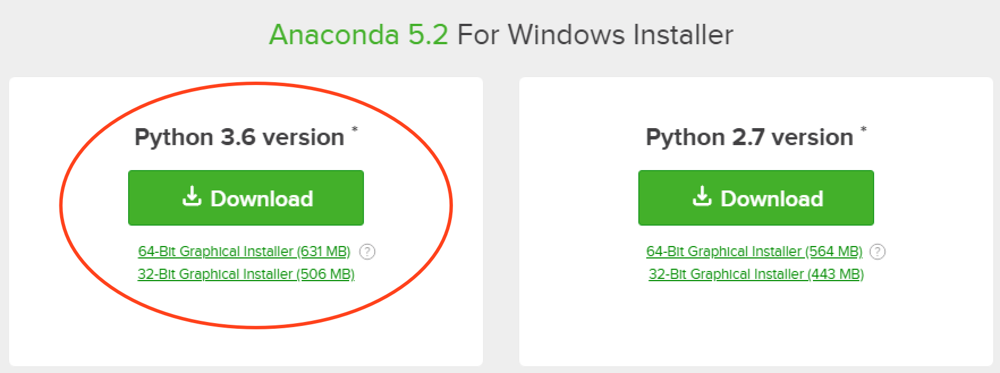
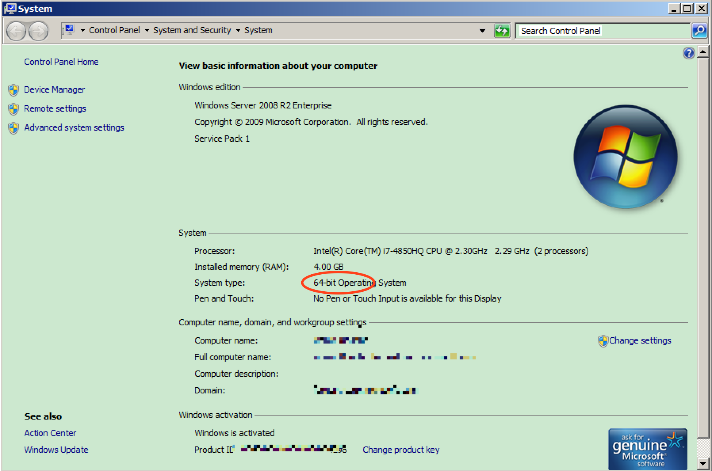
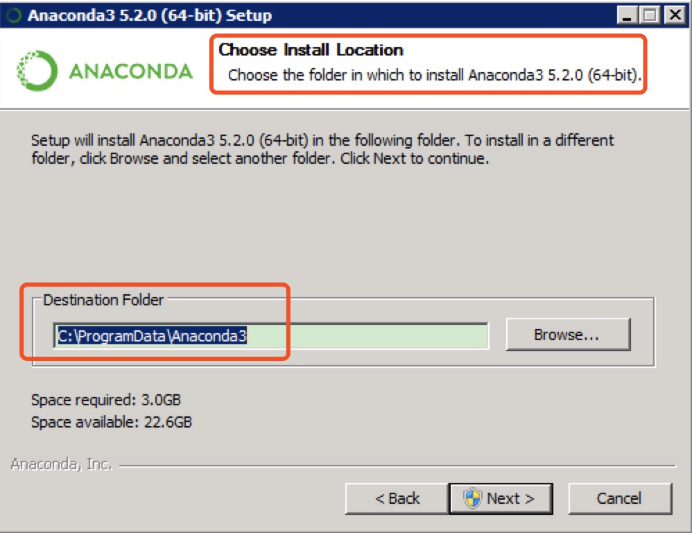
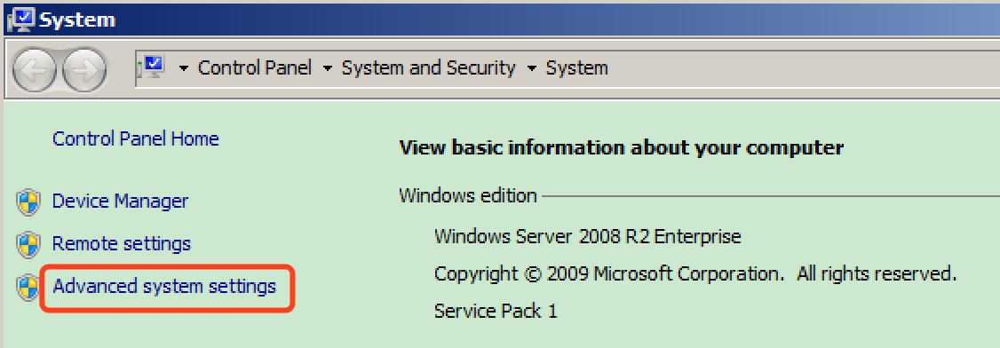
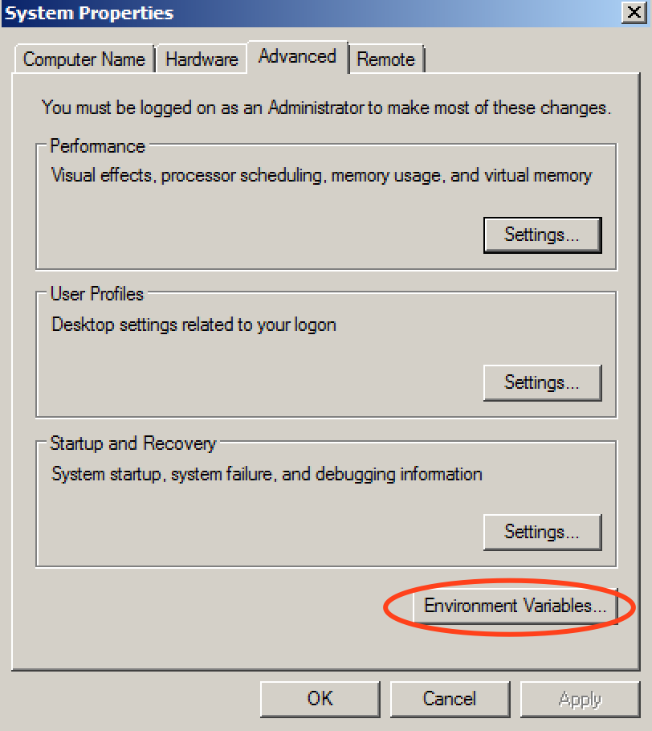
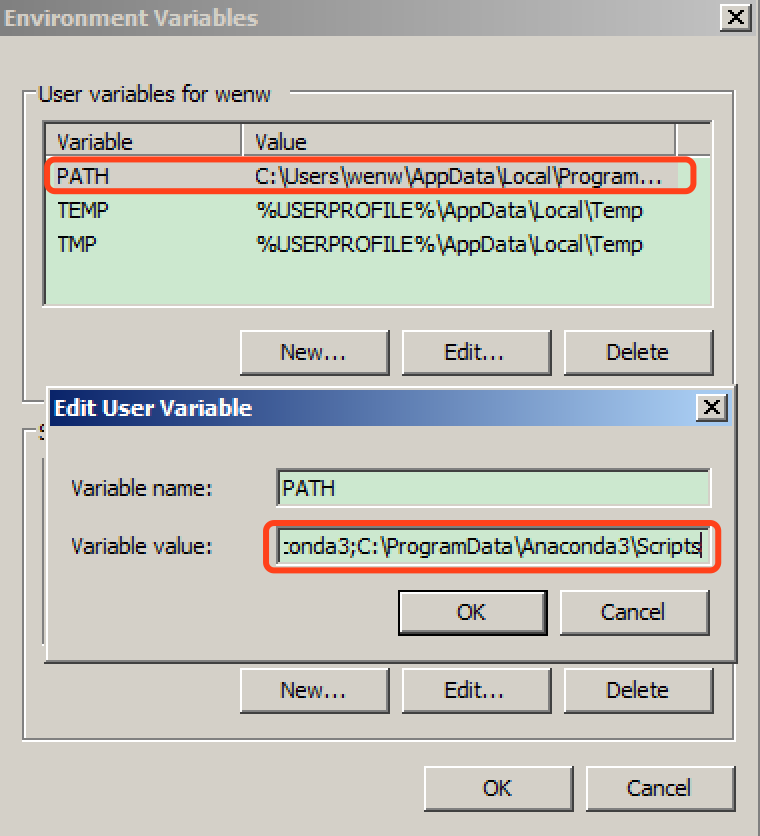

# 安装 Anaconda

## 1. 注意事项

- 本文是 Anaconda 的安装文档
- 适用的操作系统：Win7 - Win11

## 2. 安装步骤

- 下载 Anaconda
  - [下载页面](https://www.anaconda.com/download/#windows)，选择3版本

    

  - 这里要看你的操作系统是 32bit 还是 64bit，可以通过`我的电脑 / 右键`查看，如果不会看就选 32bit，但一般都应该是 64bit

  

- 安装 Anaconda
  - 下载后可以开始安装，安装时一路**默认安装**，选安装路径的时候要记一下，不同的系统中安装路径不同

    

- 配置环境变量
  - 比如，假设 Anaconda 默认会安装在 `C:\ProgramData\Anaconda3` 目录，将此目录添加到环境变量PATH
  - `我的电脑 / 空白处右键 / 属性 (Properties)`
  - `高级系统设置 (Advanced system settings)`

    

  - `环境变量 (Environment Variables)`

    

  - 如果没有 `PATH` 这个环境变量，就新建一个
  - 然后将 `C:\ProgramData\Anaconda3;C:\ProgramData\Anaconda3\Scripts;` 添加到 `PATH`
    环境变量开头，环境变量中的各个字符串用分号隔开。注意，这里假设 Anaconda 的安装路径是 `C:\ProgramData\Anaconda3`。如果安装在其它路径，要相应地修改。

    

- 验证 Anaconda 安装完成
  - **重新打开**一个cmd窗口，运行：`python --version`
  - 出现：`Python 3.6.5 :: Anaconda, Inc.`，表示Python安装成功。

- 如果发现 `import numpy` 或者 pandas
  时报错：`numpy：DLL load failed while importing _multiarray_umath: 找不到指定的模块`，是需要把
  `C:\ProgramData\anaconda3\Library\bin` 添加到 Path
  环境变量，[参考](https://www.cnblogs.com/maomaozi/p/14619961.html)

## 3. 参考文档

- [Anoconda 入门文档](http://docs.anaconda.com/anaconda/user-guide/getting-started/)
- [Anaconda Navigtor 的使用](https://docs.anaconda.com/anaconda/navigator/getting-started)
- [Conda](https://conda.io/docs/user-guide/getting-started.html)
- [Jupyter notebook 的使用](https://jupyter-notebook.readthedocs.io/en/latest/notebook.html)，[Running the Notebook](https://jupyter.readthedocs.io/en/latest/running.html)

  ```console
  $ pip install jupyter

  $ jupyter notebook --generate-config
  Writing default config to: /Users/wxdev_mac/.jupyter/jupyter_notebook_config.py

  $ jupyter notebook password
  Enter password: 
  Verify password: 
  [NotebookPasswordApp] Wrote hashed password to /Users/wxdev_mac/.jupyter/jupyter_notebook_config.json

  $ cat /Users/wxdev_mac/.jupyter/jupyter_notebook_config.json
  {
  	"NotebookApp": {
  		"password": "sha1:1425316e1d8f:63015b34f2e6aed7be2773b187da8902ff826ef6"
  	}
  }

  $jupyter notebook --no-browser
  ```
