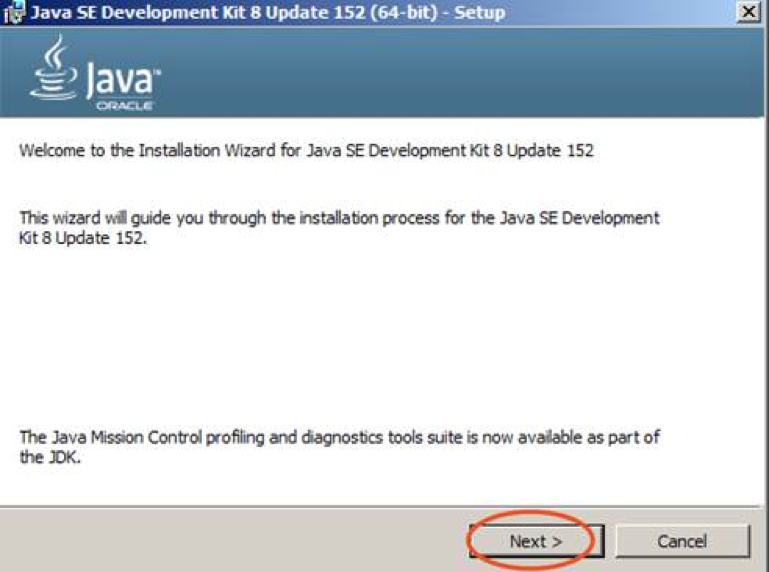
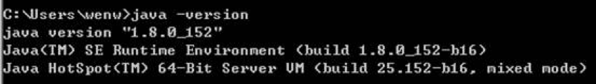
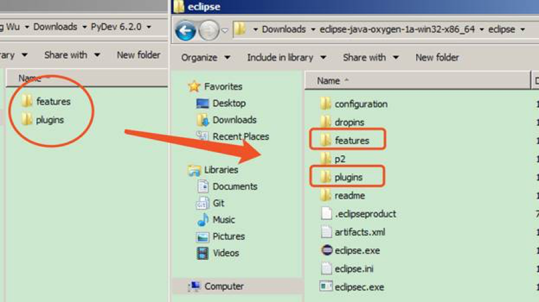
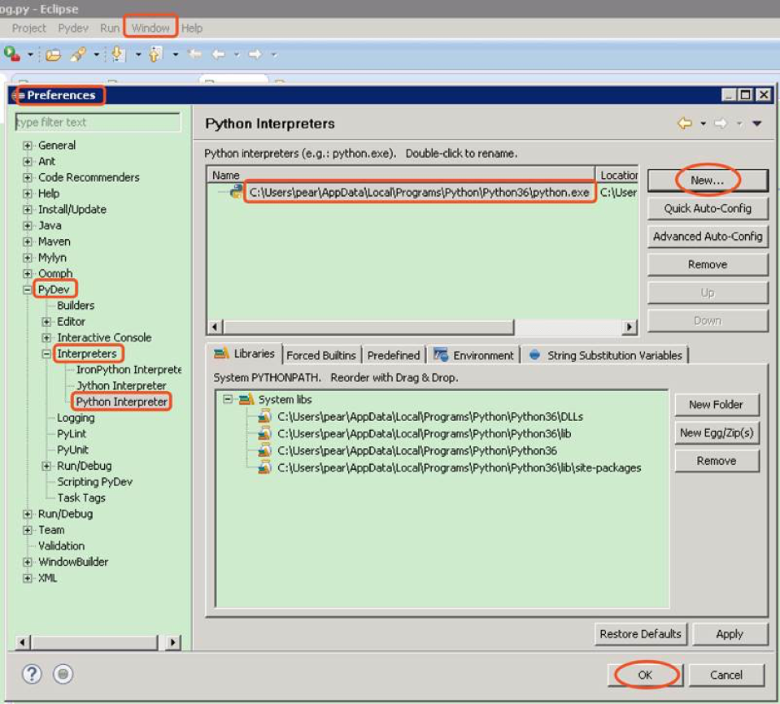
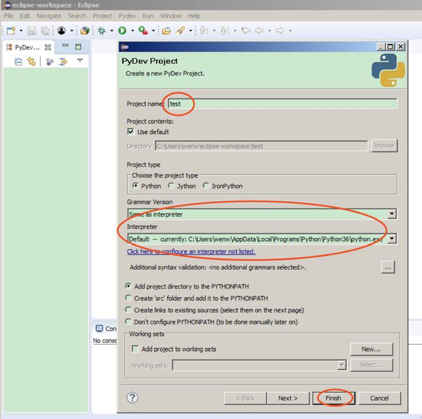
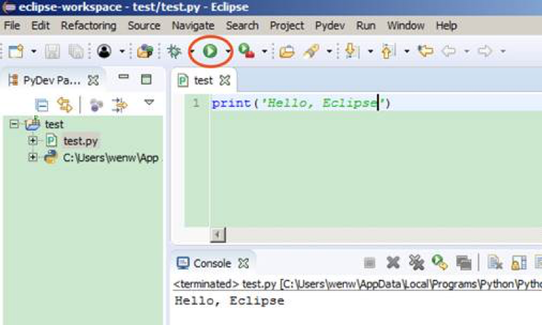

## Eclipse+Pydev

### 注意事项

- 本文描述了 `Eclipse+Pydev` IDE开发环境的安装和配置过程。
- 本文用到的软件都可以在[这里](https://share.weiyun.com/57jaLHW)下载
	- Java
	- Eclipse
	- Pydev

### 安装步骤：

- 安装 Python，确认 Python 安装完成
	- 打开一个 CMD 窗口，运行 `python --version` 和 `pip --version` 可以看到正常版本信息

		

	- 如果没有安装，可以安装[纯净版 Python](Installation-Python.md)，或者 [Anaconda](Installation-Anaconda.md)，二者有其一即可
- 安装Java
	- 下载 Java，至少 1.8 以上，一路默认安装

		

	- 验证 Java 是否装好，**重新**打开一个 CMD 窗口，运行命令：`java -version`

		

- 安装 Eclipse
	- 安装 Eclipse，解压缩 Eclipse，解压缩 Pydev，将 Pydev 下的两个目录，复制到 eclipse 目录下，覆盖同名目录

		

	- 然后 Eclipse 就应该可以正常打开了，关闭欢迎页面。
	- 然后配置 Pydev，Window / Preference / Pydev / Interpreters / Python Interpreter，可以直接选 Quick Auto Config，完成自动配置。如果自动配置不成功，可以选 New，然后选择 Python 的安装目录。

		

	- 验证 Eclipse 是否装好，File / New / Project / Pydev / Pydev Project

		

		
