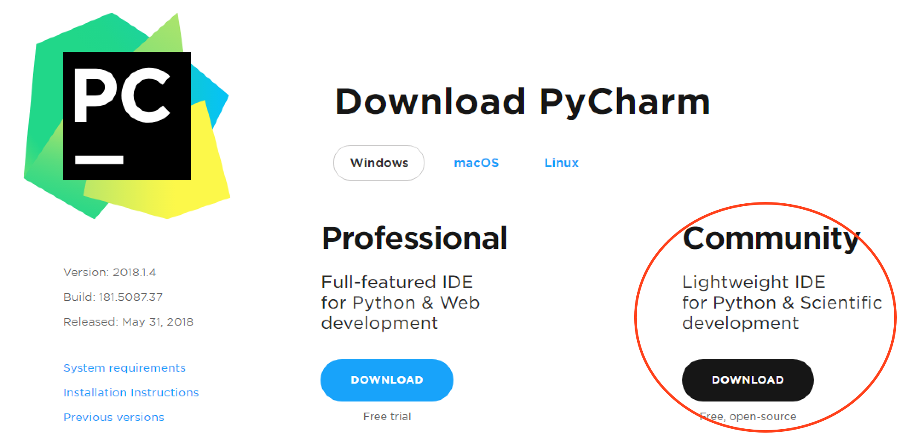
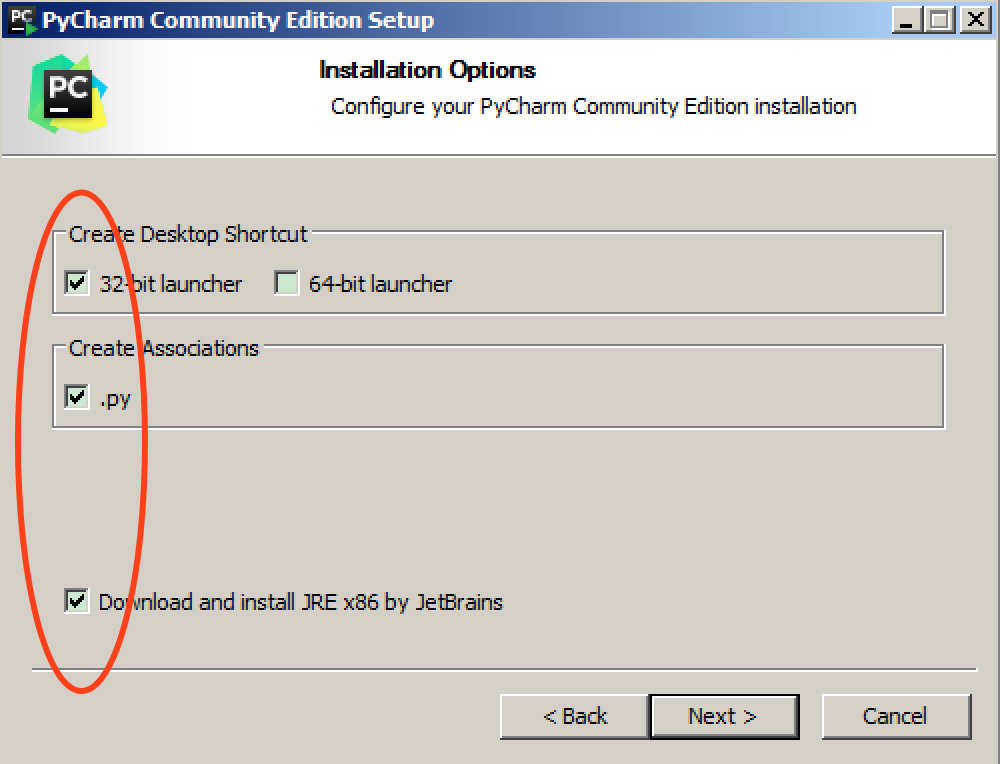
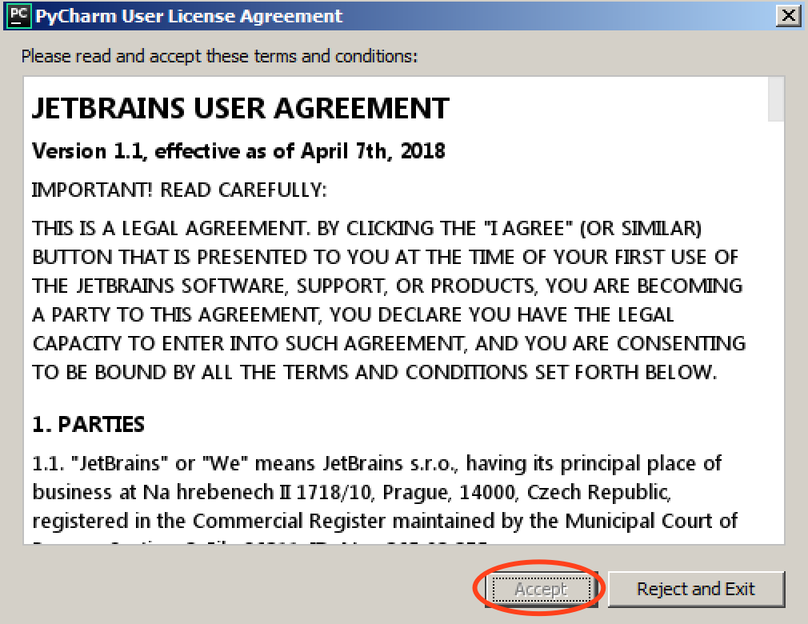
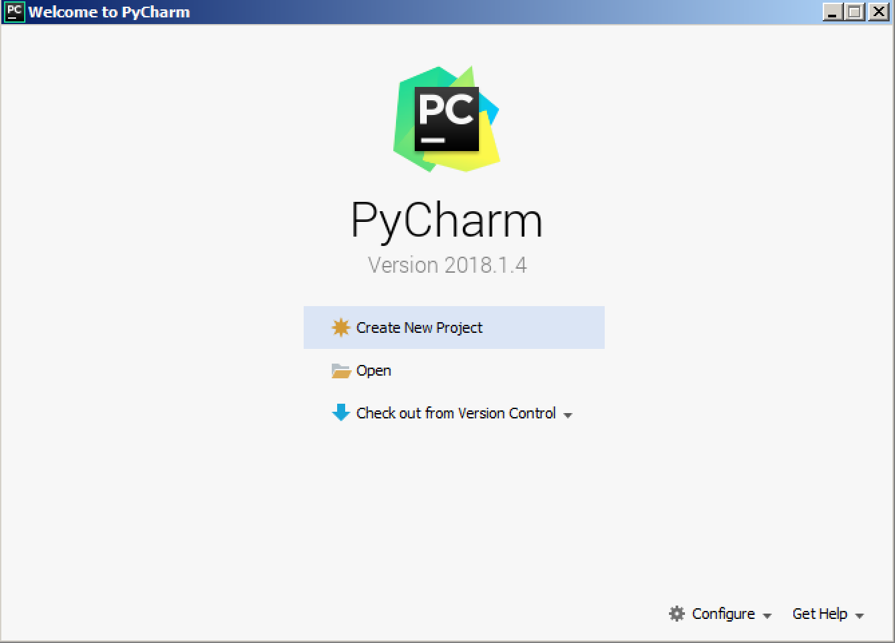
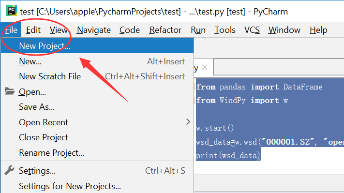
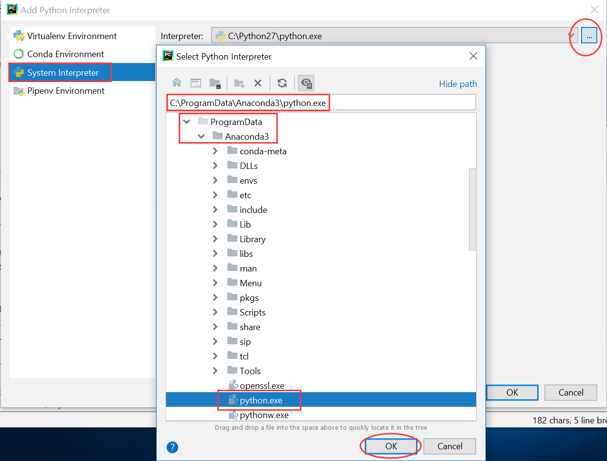
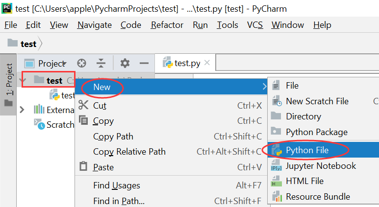
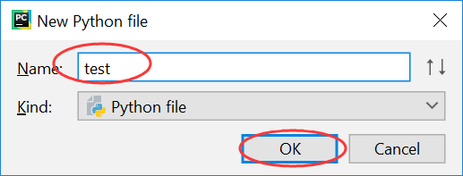
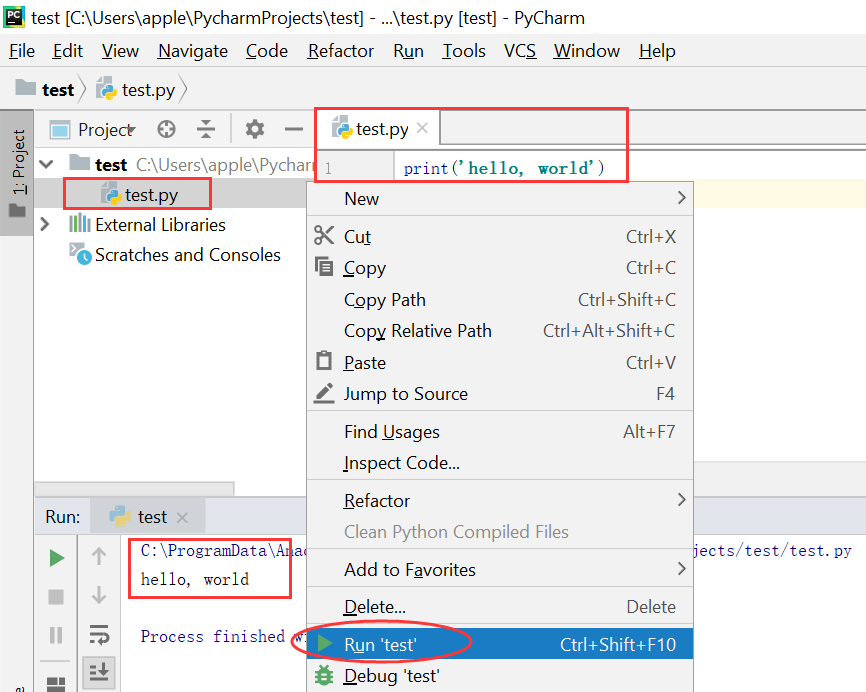

## 安装PyCharm

### 注意事项

- 本文是 Pycharm 的安装文档
- 适用于 Win7 - Win11

### 安装步骤

- 安装 Python，确认 Python 安装完成
	- 打开一个 CMD 窗口，运行 `python --version` 和 `pip --version` 可以看到正常版本信息

		

	- 如果没有安装，可以安装[纯净版 Python](Installation-Python.md)，或者 [Anaconda](Installation-Anaconda.md)，二者有其一即可
- 安装 Pycharm
	- [下载页面](https://www.jetbrains.com/pycharm/download/#section=windows)，选择社区版

		

	- 下载后一路默认安装，直至如下界面，勾选如下

		

	- 安装完成后，首次打开 Pycharm，会出现 License 说明，拖到最后，Accept 就变成黑色，可以确认

		

	- 之后就走到此页面，可以打开或者新建一个Python项目

		

- 创建项目
	- 在创建了第一个项目之后，如果还想创建 `Project`，可以通过 `File/New Project` 创建

		

	- 为方便起见，我们可以不使用默认的虚拟环境，而是直接指定系统的 Python解释器（Anaconda 中的 Python，或者纯净版的 Python）

		

		

- 在项目中创建 Python 文件
	- 创建完项目后，可以在项目上右键，创建 Python 文件

		

		

	- 然后在新建的文件中写上 `print('hello, world!')`，运行代码

		