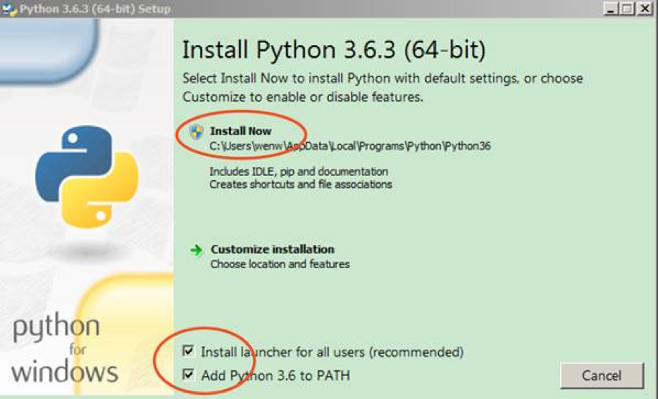

## Python安装

### 注意事项

- 本文描述了纯净版 Python 开发环境的安装和配置过程。
- Python3 只支持 Windows 7 SP1 以上版本
- 如果是 XP 或者 Win7 RTM，只能安装 Python2
- Python 安装包的[下载地址](https://www.python.org/downloads/)

### 安装步骤

- 安装 Python，注意勾选 `Add Python to PATH`，然后一路默认就好。

    

- **重新**打开一个 CMD 窗口，验证 Python 是否装好，运行命令：`python --version` 和 `pip --version`

    
