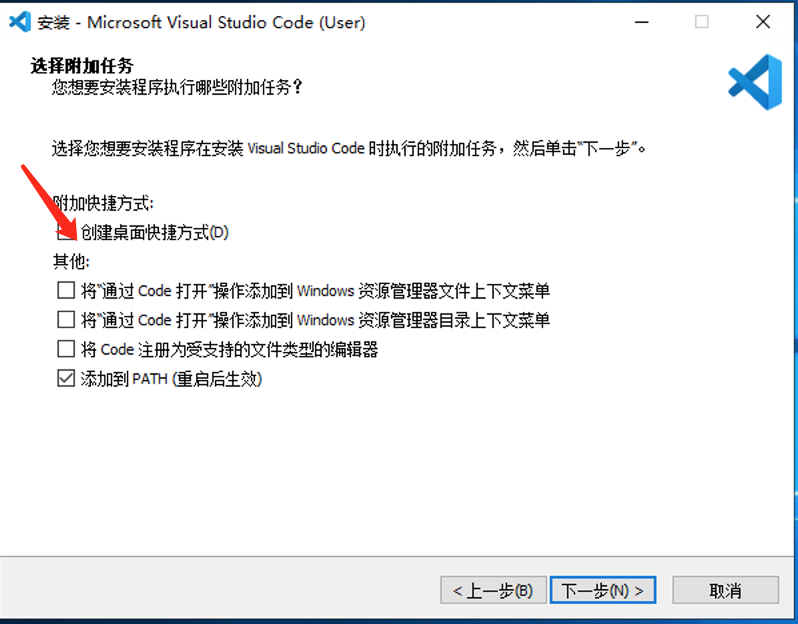
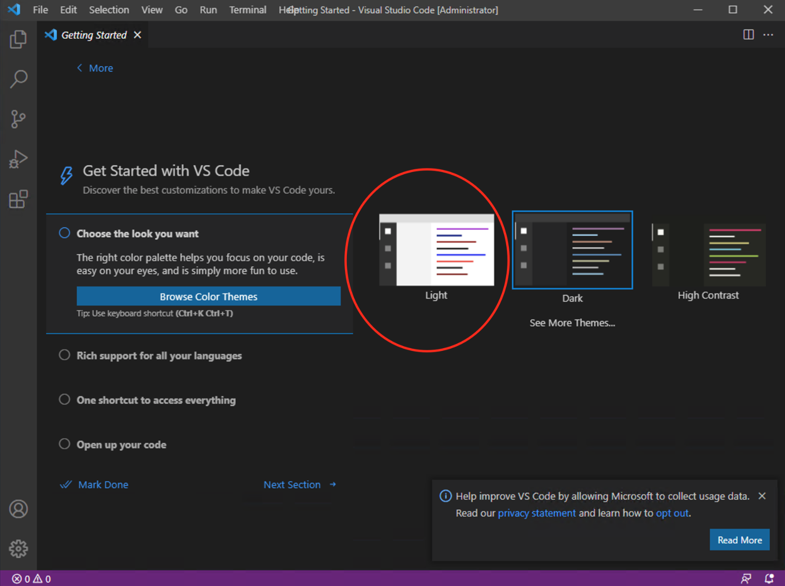
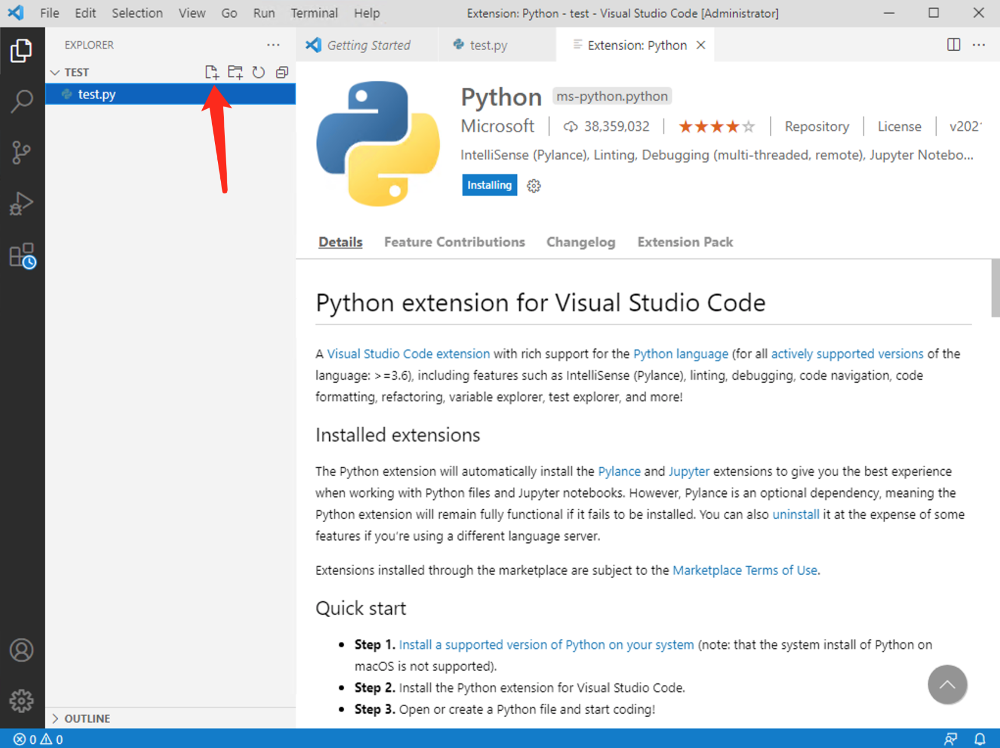
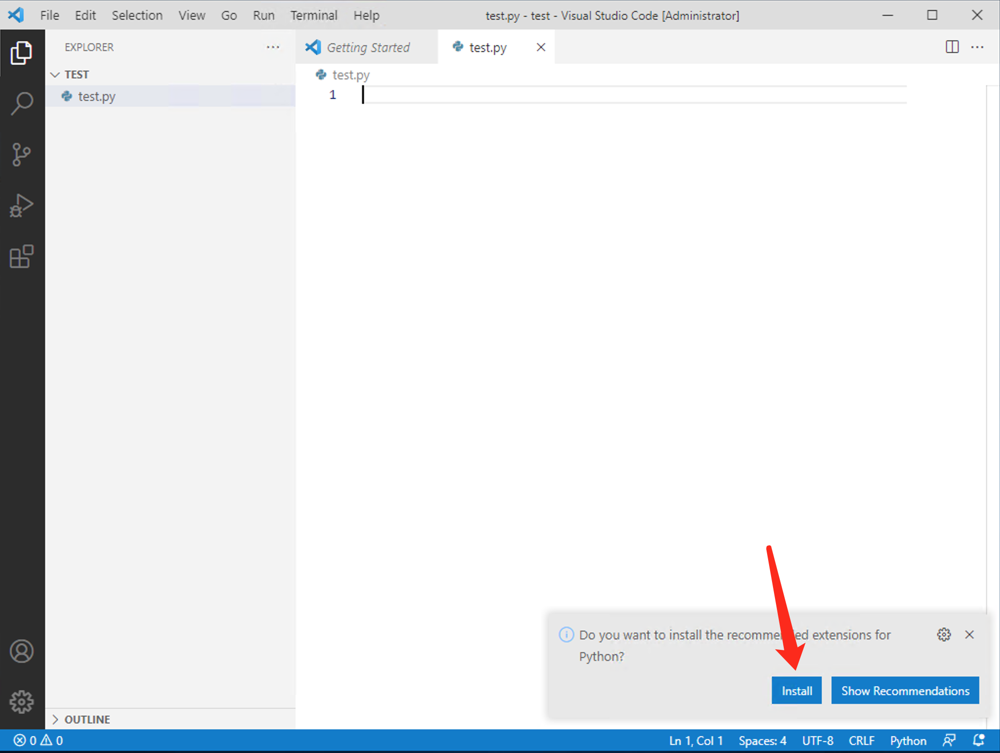
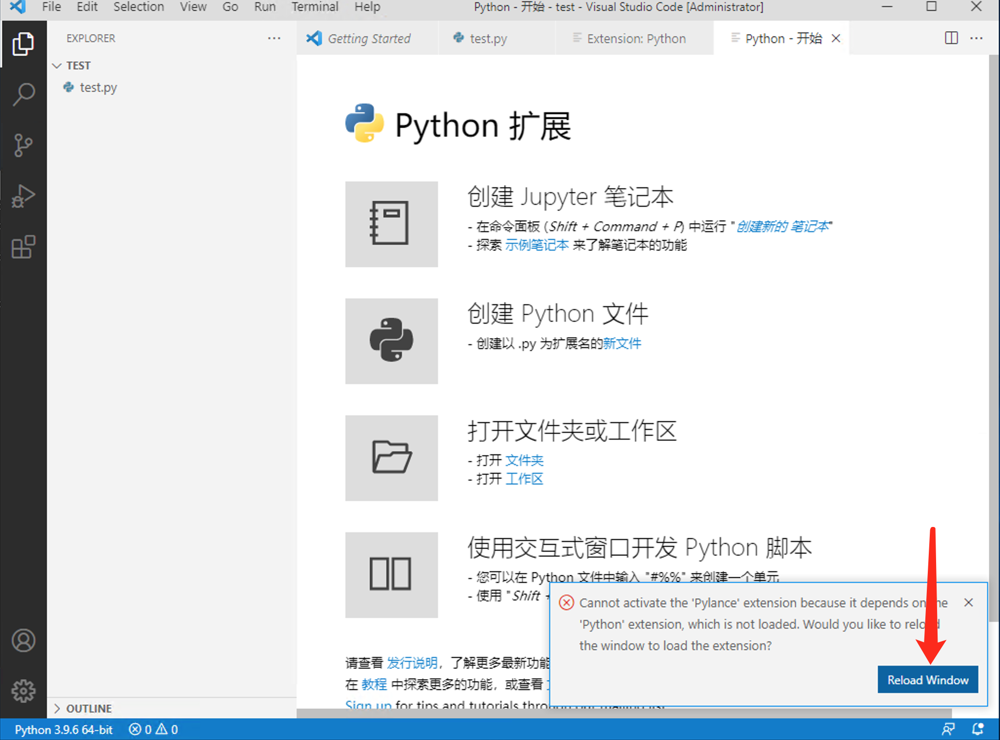

# 安装 VS Code

## 1. 参考

- 参考：[Python in Visual Studio Code](https://code.visualstudio.com/docs/languages/python)
- 参考：[Getting Started with Python in VS Code](https://code.visualstudio.com/docs/python/python-tutorial)

## 2. 安装和配置 VSCode

1. 双击安装，可以选择在桌面创建快捷方式，其它默认

   

2. 安装完成后，会提示你选择主题，默认是暗黑模式，可以选择亮白主题（根据个人喜好）

   

3. 在桌面创建一个 test 目录，拖拽进 VSCode。此后 VSCode 中可以看到这个文件夹
4. 在文件夹右上角可以点击按钮创建新文件 test.py，此文件会被创建到之前创建的 test 目录中。

   

5. 创建完 py 后缀的文件后，系统会提示你是否要安装 python 扩展，选 install

   

6. Python 扩展安装完成后，VSCode 会提示你 reload 窗口来应用此扩展

   

7. Reload 完成后，test.py 文件会显示语法高亮。

8. 在 test.py 文件中输入 `print('hello')`，然后在右上角点击三角按钮，可以直接运行此 Python 文件。

   
