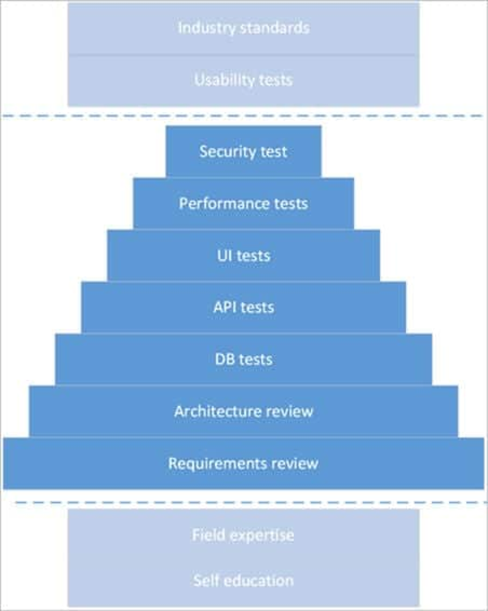
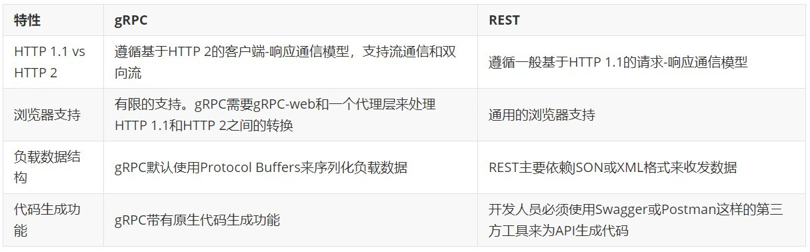
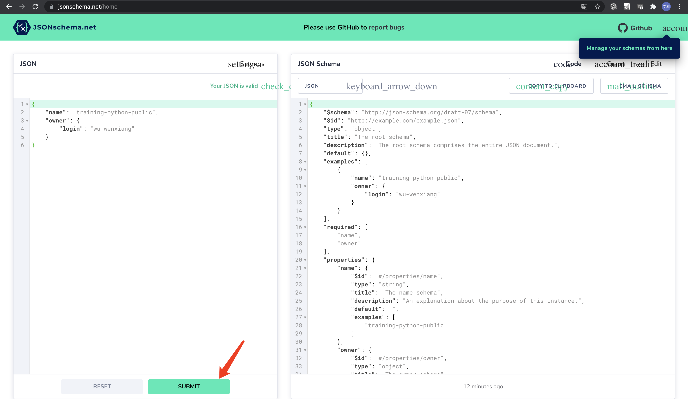
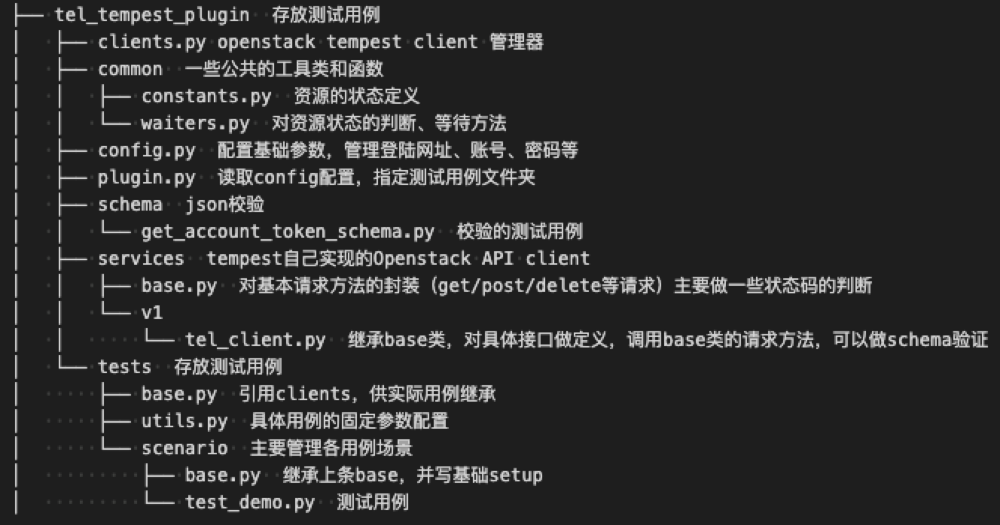
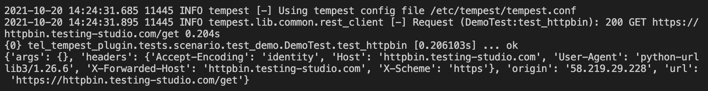

# Python 自动化测试

- 授课时长：
  - 上午：9:00 至 12:00
  - 下午：13:30 至 17:00
- Prerequisite
  - 有计算机语言编程基础
  - 了解 API 测试的基本概念
  - 掌握一种 IDE，比如 VSCode（Remote Plugin）

## 1. 基本概念

### 1.1 软件测试分几类？

- 白盒测试：
  - 单元测试
  - 数据库测试
- 黑盒测试：
  - 功能测试
    - 接口测试（功能测试 / 集成测试）
    - E2E 测试（UI 界面）
  - 非功能测试
    - 压力测试
    - 可靠性 / 恢复测试
    - 伸缩性测试
    - 安全测试

### 1.2 敏捷开发为测试带来了什么挑战？

- 为什么敏捷开发（FullStack）的测试是不够的？敏捷的原则是：功能刚好够用 + 快速迭代 => 随时可交付
- [测试应该在什么阶段介入？]((https://www.softwaretestinghelp.com/maximizing-quality-beyond-full-stack-testing/))

  

### 1.3 参考

2013/10 Google 软件测试之道

- 研发流程应该是怎样的？
  - 敏捷发布：发布应该是小差量而频繁，测试策略与发布匹配
  - 敏捷文档：所有的 Google 项目都有设计文档。这是一个动态、不断更新的文档
  - 持续集成：在代码变更提交到版本控制系统之后，自动化运行所有测试
  - 非明确不测试：在项目试验初级阶段(产品概念上还没有完全确定成型)强调测试是一件非常愚蠢的事情
  - 结果导向：只有能加速开发过程的自动化测试才有意义、测试不应该拖慢开发的速度。坚持项目快速发布
- 测试团队应该是怎样的？
  - 小而精的特种部队：依靠的是出色的战术和高级武器
  - 宁缺毋滥：选用不合适的人来填充名额永远要比等待合适的人员更糟糕
  - 一切能自动化的都应该自动化：手动测试倾向于测试新功能、用户体验、隐私之类东西，Android 最依赖手动测试
- 测试工程师应该是怎样的？
  - 测试开发工程师：
    - 是一个编码能力很强的程序员，可以写功能代码
    - 也是一个很强的测试者，具备测试思维
  - 测试工程师：
    - 首先是产品专家
    - 其次是善于进行价值分析，执行价值驱动的工程师（发现 bug 后思考：影响如何？是否在用户可达之路？是否还有更多的路径导致相同的 bug？是否存在可能影响数据和其他应用？然后可以判断是否将
      bug 加入回归测试集，将其自动化）
- 测试用例应该是怎样的？
  - 研发代码是去创建，重点在考虑用户、使用场景和数据流程上；而测试代码主要思路是去破坏、怎样写测试代码用以扰乱分离用户及其数据
  - 每个测试和其他测试之间是独立的，使它们能够以任意顺序来执行
  - 测试不做任何数据持久化方面的工作，这测试用例离开测试环境的时候，要保证测试执行前后环境的状态一致
  - 对每一个重要的缺陷修复都要增加一个测试用例与之对应
  - 不要把所有的精力都放在前端
  - 尽量使用与应用程序开发语言相同的编程语言来编写测试
    - 方便复用标准库
    - 方便收敛技术栈（测试与开发能角色互换）
  - 20% 的用例覆盖率 80% 的使用场景，把这 20% 自动化而别管剩下的

1. Six Options for More Efficient Tests: <https://www.testim.io/blog/python-test-automation/>
2. Python Test Automation: <https://automationpanda.com/2020/11/09/learning-python-test-automation/>
3. <https://www.activestate.com/blog/the-best-python-tools-for-test-automation/>
4. <https://www.softwaretestinghelp.com/python-testing-frameworks/>

## 2. 单元测试

[Python 单元测试](http://blog.wuwenxiang.net/Python-Unittest)

- Unittest & Green：反射、固件测试、Mock
- Pytest & allure：Assert Error

### 2.1 Unittest 和 Pytest 的差异

1. 用例编写规则
   - unittest 提供了 test cases、test suites、test fixtures、test runner
     相关的类，让测试更加明确、方便、可控。使用unittest编写用例，必须遵守以下规则：
     - 测试文件必须先 import unittest
     - 测试类必须继承 unittest.TestCase
     - 测试方法必须以 `test_` 开头
     - 测试类必须要有 unittest.main() 方法
   - pytest 是 python的第三方测试框架，是基于 unittest 的扩展框架，比 unittest 更简洁,更高效。使用 pytest 编写用例,必须遵守以下规则:
     - 测试文件名必须以 `test_` 开头或者 `_test` 结尾（如：`test_ab.py`）
     - 测试方法必须以 `test_` 开头。
     - 测试类命名以 Test 开头。

   pytest 可以执行 unittest 风格的测试用例，无须修改 unittest 用例的任何代码，有较好的兼容性。pytest 插件丰富，比如 flask 插件，可用于用例出错重跑；还有
   xdist 插件，可用于设备并行执行。

2. 用例前置和后置
   - unittest 提供了 setUp/tearDown，每个用例运行前、结束后运行一次。setUpClass/tearDownClass，用例执行前、结束后，只运行一次。
   - pytest提供了模块级、函数级、类极、方法级的 setup/teardown，比 unittest 更灵活
     - 模块级 `setup_module/teardown_modul` 开始于模块始末，全局的
     - 函数级 `setup_function/teardown_function` 只对函数用例生效（不在类中）
     - 类级 `setup_class/teardown_class` 只在类中前后运行一次(在类中)
     - 方法级 `setup_method/teardown_method` 开始于方法始末（在类中）
     - 类里面的 `setup/teardown` 运行在调用方法的前后
   - pytest还可以在函数前加 @pytest.fixture() 装饰器，在测试用例中装在 fixture 函数。fixture 的使用范围可以是
     function/module/class/session。firture 相对于 setup/teardown 来说有以下几点优势：
     - 命名方式灵活，不局限于setup和teardown这几个命名
     - conftest.py 配置里可以实现数据共享，不需要import就能自动找到一些配置，可供多个py文件调用
   - scope="module" 可以实现多个 .py 跨文件共享前置
   - scope="session" 以实现多个 .py 跨文件使用一个 session 来完成多个用例
   - 用 yield 来唤醒 teardown 的执行
3. 断言
   - unittest 提供了 assertEqual、assertIn、assertTrue、assertFalse。
   - pytest 直接使用 assert 表达式。
4. 报告
   - unittest 使用 HTMLTestRunnerNew 库。
   - pytest 有 pytest-HTML、allure 插件。
5. 失败重跑
   - unittest 无此功能。
   - pytest 支持用例执行失败重跑，pytest-rerunfailures 插件。
6. 参数化
   - unittest 需依赖 ddt 库
   - pytest 直接使用 @pytest.mark.parametrize 装饰器。
7. 用例分类执行
   - unittest 默认执行全部用例，也可以通过加载 testsuit，执行部分用例。
   - pytest 可以通过 @pytest.mark 来标记类和方法，pytest.main 加入参数("-m")可以只运行标记的类和方法

### 2.2 Pytest

1. [pytest 安装及用例执行](https://www.cnblogs.com/hiyong/p/14163263.html)
2. [pytest 的 setup/teardown 方法](https://www.cnblogs.com/hiyong/p/14163271.html)
3. [pytest fixture 用法](https://www.cnblogs.com/hiyong/p/14163280.html)
4. [pytest 参数化用例](https://www.cnblogs.com/hiyong/p/14163287.html)

   ```python
   import pytest
   from functools import reduce


   def sumAny(*args):
       return reduce(lambda x,y: x+y, args)

   # if __name__ == '__main__':
   #     print(sumAny(1, 2, 3, 4))
   #     print(sumAny(1.2, 2.34))
   #     print(sumAny("test", "hello"))
   #     print(sumAny([1, 2, 3], ['hello']))


   class Test_Demo():
       @pytest.mark.parametrize("args, result", [
           ((1, 2, 3, 4), 10),
           ((1.2, 2.34), 3.54),
           (("test", "hello"), 'testhello'),
           (([1, 2, 3], ['hello']), [1, 2, 3, 'hello'])])
       def test_case1(self, args, result):
           ret = sumAny(*args)
           assert ret == result


   if __name__ == '__main__':
       pytest.main()
   ```

5. [pytest + allure 生成测试报告](https://www.cnblogs.com/hiyong/p/14163298.html)

## 3. 数据库操作

[Demo](python-exec-public.py#L1757)：

- DB Driver
- SqlAlchemy ORM 模型
- Pandas 快速处理

## 4. 接口测试

### 4.1 REST API 接口基本概念

- [什么是 Restful API 设计？](https://www.ics.uci.edu/~fielding/pubs/dissertation/rest_arch_style.htm)
  - 客户端-服务器约束：用户界面问题与数据存储分开
  - 无状态约束：会话状态完全保留在客户端
  - [统一接口约束](https://www.ics.uci.edu/~fielding/pubs/dissertation/rest_arch_style.htm#sec_5_2)
- REST API 设计的两大核心原则
  - API 应该作用于 Resource（资源）上
  - 对资源的操作应使用对应语义的几种操作，包括：GET, POST, PUT, PATCH, DELETE, HEAD, OPTIONS
- REST API 设计中的常见注意事项
  1. 用户注册：`POST /users`，资源即为 users。API 中的资源一般与你的数据模型（也就是数据库的表）是一一对应的。如果要创建管理员，创建“管理员”，`POST /admins`
     是否合适？思考数据库中是否会有一张 admin 表？
  2. 资源的命名，一般为英文的复数。比如说 users 而不是 user
  3. 服务不应该只有 POST 和 GET

     ```
     GET /tickets - 列出所有车票
     GET /tickets/9839 - 列出 id 为 9839 这张车票的信息
     POST /tickets - 创建一张车票
     PUT /tickets/9839 - 更新 9839 这张车票的信息
     PATCH /tickets/9839 - 部分修改 983 这张车票的信息，比如只修改车票价格
     DELETE /tickets/9839 - 删掉 9839 这张车票

     HEAD 请求用于获取某个资源的元数据 metadata，比如，该资源是否存在，该资源的内容长度是多少等等。
     OPTIONS 请求用于获取某个资源所支持的 Request 类型，在 OPTIONS 请求的 Response 中会包含Allow头信息，比如：Allow: GET HEAD，上述例子表示该资源只支持GET请求与HEAD请求。值得注意的是，在 OPTIONS 请求中，不同的 Request 头信息会影响最终返回的 Response 结果。比如，在 OPTIONS 请求中加入正确的 Authorization 信息，得到的访问权限就可能更高。
     ```

  4. 如何在 API 中表示实体（数据库表）间关系

     ```
     GET /owners/  - 获取所有主人信息

     GET /owners/1/pets/ 获取 id 为 1 的主人的所有宠物
     GET /pets/?owner=1 也可以

     GET /pets/ - 获取所有宠物信息（宠物店所有宠物）
     GET /pets/13 - 直接获取 id 为 13 的宠物
     ```

  5. REST API Endpoint 中都是资源，因此理论上不能有动词，只能有名词。那如何表示一个动作，比如登陆
     - POST /users/login
     - 如果你是以 token 密钥的方式登录的话，也许可以改为 POST /users/token，即创建一个 user token
     - Github 把加星端点设计为 PUT /gists/:id/star，把取消加星设计为 DELETE /gitsts/:id/star。这样就完美地遵循了 REST
       名词作为资源的准则，把动词"加星“完美地用 PUT/DELETE 两个操作
  6. REST API 如何区分版本？

     ```
     GET /v1/indexes/
     GET /v1/indexes/abc/
     POST /v1/indexes/
     ```

  7. REST API 应该返回什么？JSON，没有其它选项。建议打开 Pretty Print 和 Gzip。在 JSON 稍变得复杂之后，如果没有 Pretty print 的 JSON
     将会变得完全不可读。虽然打开 Pretty print 会增加一些空白字符，但是由于打开 Gzip 压缩，这些空白字符所占用的空间都会被压缩掉，所以并不用担心网络传输时，JSON
     变得更大更慢。现在的浏览器或者客户端工具会自动解析 JSON，所以这一条不一定。

     ```json
     {"name":"大话西游","actor":"周星驰"}

     {
         "name": "大话西游",
         "actor": "周星驰"
     }
     ```

  8. 返回结果（Response）针对不同操作，服务器向用户返回的结果应该符合以下规范。

     ```
     GET /collection：返回资源对象的列表（数组）
     GET /collection/resource：返回单个资源对象
     POST /collection：返回新生成的资源对象
     PUT /collection/resource：返回完整的资源对象
     PATCH /collection/resource：返回完整的资源对象
     DELETE /collection/resource：返回一个空文档
     ```

  9. RESTful API 最好使用 Hypermedia as the Engine of Application
     State（超媒体作为应用状态的引擎），即返回结果中提供链接，连向其他API方法，超文本链接可以建立更好的文本浏览，使得用户不查文档，也知道下一步应该做什么。比如，当用户向api.example.com的根目录发出请求，会得到这样一个文档。

     ```json
     {
         "link": {
             "rel":   "collection https://www.example.com/zoos",
             "href":  "https://api.example.com/zoos",
             "title": "List of zoos",
             "type":  "application/vnd.yourformat+json"
         }
     }
     ```

     上面代码表示，文档中有一个 link 属性，用户读取这个属性就知道下一步该调用什么 API 了。rel 表示这个 API 与当前网址的关系（collection 关系，并给出该
     collection 的网址），href 表示 API 的路径，title 表示 API 的标题，type 表示返回类型。

  10. 认证（Authentication）API 的身份认证尽量使用 OAuth 2.0 框架。
  11. 过滤信息

      ```
      ?limit=10：指定返回记录的数量
      ?offset=10：指定返回记录的开始位置。
      ?page_number=2&page_size=100：指定第几页，以及每页的记录数。
      ?sortby=name&order=asc：指定返回结果按照哪个属性排序，以及排序顺序。
      ?animal_type_id=1：指定筛选条件
      参数的设计允许存在冗余，即允许API路径和URL参数偶尔有重复。比如，
      GET /zoo/ID/animals 与 GET /animals?zoo_id=ID 的含义是相同的。
      ```

  12. 排序
  13. 错误处理

      ```json
      {
        "errors": [
          {
            "userMessage": "Sorry, the requested resource does not exist",
            "internalMessage": "No car found in the database",
            "code": 34,
            "more info": "http://dev.mwaysolutions.com/blog/api/v1/errors/12345"
          }
        ]
      }
      ```

- 常见误区
  - 接口中滥用动词

        ```
        /getAllCars
        /createNewCar
        /deleteAllRedCars

        查询某个对象接口：GET /app/getImportantApp
        查询列表接口：GET /app/list
        保存对象接口：POST /app/save
        删除对象接口：POST /app/delete
        更新对象接口：POST /app/batchUpdate

        /posts/show/1
        应该 /posts/1，然后用 GET 方法表示 show

        某些动作是 HTTP 动词表示不了的，应该把动作做成一种资源。比如网上汇款，从账户 1 向账户 2 汇款 500 元

        POST /accounts/1/transfer/500/to/2
        更好的写法：POST /transaction?from=1&to=2&amount=500.00
        ```

  - URI 中路径大小写问题

        ```
        URL 中路径最好是小写，不要有驼峰式写法

        POST /orderItems/v1/1001

        POST /orders/v1/items/1001
        POST /order-items/v1/1001
        ```

- [如何判断服务是否以正确的值响应？](https://restfulapi.net/http-status-codes/)

      ```
      1xx 信息，请求收到，继续处理。范围保留用于底层HTTP的东西，你很可能永远也用不到。
      2xx 成功，行为被成功地接受、理解和采纳
      3xx 重定向，为了完成请求，必须进一步执行的动作
      4xx 客户端错误，请求包含语法错误或者请求无法实现。范围保留用于响应客户端做出的错误，例如。他们提供不良数据或要求不存在的东西。这些请求应该是幂等的，而不是更改服务器的状态。
      5xx 范围的状态码是保留给服务器端错误用的。这些错误常常是从底层的函数抛出来的，甚至
      开发人员也通常没法处理，发送这类状态码的目的以确保客户端获得某种响应。
      当收到5xx响应时，客户端不可能知道服务器的状态，所以这类状态码是要尽可能的避免。
      ```

  - 200 OK - [GET]：服务器成功返回用户请求的数据，该操作是幂等的（Idempotent）。
  - 201 CREATED - [POST/PUT/PATCH]：用户新建或修改数据成功。
  - 202 Accepted - [*]：表示一个请求已经进入后台排队（异步任务）
  - 204 NO CONTENT - [DELETE]：用户删除数据成功。
  - 400 INVALID REQUEST - [POST/PUT/PATCH]：用户发出的请求有错误，服务器没有进行新建或修改数据的操作，该操作是幂等的。
  - 401 Unauthorized - [*]：表示用户没有权限（令牌、用户名、密码错误）。
  - 403 Forbidden - [*]：表示用户得到授权（与401错误相对），但是访问是被禁止的。
  - 404 NOT FOUND - [*]：用户发出的请求针对的是不存在的记录，服务器没有进行操作，该操作是幂等的。
  - 406 Not Acceptable - [GET]：用户请求的格式不可得（比如用户请求JSON格式，但是只有XML格式）。
  - 410 Gone -[GET]：用户请求的资源被永久删除，且不会再得到的。
  - 422 Unprocesable entity - [POST/PUT/PATCH]：当创建一个对象时，发生一个验证错误。
  - 500 INTERNAL SERVER ERROR - [*]：服务器发生错误，用户将无法判断发出的请求是否成功。
- Swagger API 标准

  Swagger 是一个规范和完整的框架，用于生成、描述、调用和可视化RESTful风格的Web服务。Swagger 的目标是对 REST API
  定义一个标准的和语言无关的接口，可让人和计算机无需访问源码、文档或网络流量监测就可以发现和理解服务的能力。

  Swagger 规范定义了一组描述一个 API 所需的文件格式，类似于描述 Web 服务的 WSDL。通过 Swagger 进行 REST API
  的正确定义，用户可以理解远程服务并使用最少实现逻辑与远程服务进行交互。与为底层编程所实现的接口类似，Swagger 消除了调用服务时可能会有的猜测。Swagger 这类 API
  文档工具可以满足下列需求：

  - 支持 API 自动生成同步的在线文档
  - 这些文档可用于项目内部 API 审核
  - 方便测试人员了解 API
  - 这些文档可作为客户产品文档的一部分进行发布
  - 支持 API 规范生成代码，生成的客户端和服务器端骨架代码可以加速开发和测试速度
  - 通常情况下，API 的 Swagger 描述为 JSON 文件，也可使用 YAML 描述的文件

    ```json
    {
        "swagger": "2.0",
        "info": {
            "version": "1.0.0",
            "title": "Swagger Petstore (Simple)",
            "description": "A sample API that uses a petstore as an example to demonstrate features in the swagger-2.0 specification",
            "termsOfService": "http://helloreverb.com/terms/",
            "contact": {
            "name": "Swagger API team",
            "email": "foo@example.com",
            "url": "http://swagger.io"
            },
            "license": {
            "name": "MIT",
            "url": "http://opensource.org/licenses/MIT"
            }
        },
        "host": "petstore.swagger.io",
        "basePath": "/api",
        "schemes": [
            "http"
        ],
        "consumes": [
            "application/json"
        ],
        "produces": [
            "application/json"
        ],
        "paths": {
            "/pets": {
            "get": {
                "description": "Returns all pets from the system that the user has access to",
                "operationId": "findPets",
                "produces": [
                "application/json",
                "application/xml",
                "text/xml",
                "text/html"
                ],
                "parameters": [
                {
                    "name": "tags",
                    "in": "query",
                    "description": "tags to filter by",
                    "required": false,
                    "type": "array",
                    "items": {
                    "type": "string"
                    },
                    "collectionFormat": "csv"
                },
                {
                    "name": "limit",
                    "in": "query",
                    "description": "maximum number of results to return",
                    "required": false,
                    "type": "integer",
                    "format": "int32"
                }
                ],
                "responses": {
                "200": {
                    "description": "pet response",
                    "schema": {
                    "type": "array",
                    "items": {
                        "$ref": "#/definitions/pet"
                    }
                    }
                },
                "default": {
                    "description": "unexpected error",
                    "schema": {
                    "$ref": "#/definitions/errorModel"
                    }
                }
                }
            },
            "post": {
                "description": "Creates a new pet in the store.  Duplicates are allowed",
                "operationId": "addPet",
                "produces": [
                "application/json"
                ],
                "parameters": [
                {
                    "name": "pet",
                    "in": "body",
                    "description": "Pet to add to the store",
                    "required": true,
                    "schema": {
                    "$ref": "#/definitions/newPet"
                    }
                }
                ],
                "responses": {
                "200": {
                    "description": "pet response",
                    "schema": {
                    "$ref": "#/definitions/pet"
                    }
                },
                "default": {
                    "description": "unexpected error",
                    "schema": {
                    "$ref": "#/definitions/errorModel"
                    }
                }
                }
            }
            },
            "/pets/{id}": {
            "get": {
                "description": "Returns a user based on a single ID, if the user does not have access to the pet",
                "operationId": "findPetById",
                "produces": [
                "application/json",
                "application/xml",
                "text/xml",
                "text/html"
                ],
                "parameters": [
                {
                    "name": "id",
                    "in": "path",
                    "description": "ID of pet to fetch",
                    "required": true,
                    "type": "integer",
                    "format": "int64"
                }
                ],
                "responses": {
                "200": {
                    "description": "pet response",
                    "schema": {
                    "$ref": "#/definitions/pet"
                    }
                },
                "default": {
                    "description": "unexpected error",
                    "schema": {
                    "$ref": "#/definitions/errorModel"
                    }
                }
                }
            },
            "delete": {
                "description": "deletes a single pet based on the ID supplied",
                "operationId": "deletePet",
                "parameters": [
                {
                    "name": "id",
                    "in": "path",
                    "description": "ID of pet to delete",
                    "required": true,
                    "type": "integer",
                    "format": "int64"
                }
                ],
                "responses": {
                "204": {
                    "description": "pet deleted"
                },
                "default": {
                    "description": "unexpected error",
                    "schema": {
                    "$ref": "#/definitions/errorModel"
                    }
                }
                }
            }
            }
        },

        "definitions": {
            "pet": {
            "type": "object",
            "required": [
                "id",
                "name"
            ],
            "properties": {
                "id": {
                "type": "integer",
                "format": "int64"
                },
                "name": {
                "type": "string"
                },
                "tag": {
                "type": "string"
                }
            }
            },
            "newPet": {
            "type": "object",
            "required": [
                "name"
            ],
            "properties": {
                "id": {
                "type": "integer",
                "format": "int64"
                },
                "name": {
                "type": "string"
                },
                "tag": {
                "type": "string"
                }
            }
            },
            "errorModel": {
            "type": "object",
            "required": [
                "code",
                "message"
            ],
            "properties": {
                "coe": {
                "type": "integer",
                "format": "int32"
                },
                "message": {
                "type": "string"
                }
            }
            }
        }
    }
    ```

- Restful API 和 GRPC 接口的自动化测试有哪些异同？gRPC 提供了许多优势，但它有一个主要障碍：浏览器兼容性低。因此，gRPC 的用例一般局限在内部/私有系统

  

- Rest API Demo：[Github](https://github.com/wu-wenxiang/rest_api_demo) &
  [Gitee](https://gitee.com/wu-wen-xiang/rest_api_demo)，对象s + CRUD

      ```bash
      docker stop rest-api-demo
      docker rm rest-api-demo
      docker run -d -p 9999:8888 --name=rest-api-demo maodouzi/rest-api-demo:3.9.6

      # 访问：http://<外网IP>:9999/api/
      ```

### 4.2 常见工具

- Netmon / Wireshark / tcpdump
- Fiddler
- Postman

### 4.3 Requests

- 准备
  - 参考文档：[中文](https://docs.python-requests.org/zh_CN/latest/) 或
    [英文](https://docs.python-requests.org/en/master/)
  - 安装：`pip3 install requests`
  - http
    请求响应测试接口：<https://httpbin.testing-studio.com/>，源码：[Github](https://github.com/postmanlabs/httpbin)
- 常见接口请求

  ```python
  >>> import requests
  >>> r = requests.post('http://<外网IP>:9999/api/', json={'name': 'testNewCategories'})
  >>> r.status_code
  200
  ```

  ```python
  >>> import requests
  >>> r = requests.get('https://api.github.com/events')
  >>> r.status_code
  200

  >>> r.text[:50]
  '[{"id":"17531424137","type":"PullRequestEvent","ac'
  >>> r.content[:50]
  b'[{"id":"17531424137","type":"PullRequestEvent","ac'
  >>> r.encoding
  'utf-8'

  >>> r = requests.post('http://httpbin.org/post', data={'key': 'value'})
  >>> import json
  >>> json.loads(r.text)
  {'args': {}, 'data': '', 'files': {}, 'form': {'key': 'value'}, 'headers': {'Accept': '*/*', 'Accept-Encoding': 'gzip, deflate', 'Content-Length': '9', 'Content-Type': 'application/x-www-form-urlencoded', 'Host': 'httpbin.org', 'User-Agent': 'python-requests/2.25.1', 'X-Amzn-Trace-Id': 'Root=1-61145403-5e8bb0f66830a61e47862530'}, 'json': None, 'origin': '101.85.192.4', 'url': 'http://httpbin.org/post'}
  >>> r.json()
  ...

  >>> import pprint
  >>> pprint.pprint(r.json())
  {'args': {},
  'data': '',
  'files': {},
  'form': {'key': 'value'},
  'headers': {'Accept': '*/*',
              'Accept-Encoding': 'gzip, deflate',
              'Content-Length': '9',
              'Content-Type': 'application/x-www-form-urlencoded',
              'Host': 'httpbin.org',
              'User-Agent': 'python-requests/2.25.1',
              'X-Amzn-Trace-Id': 'Root=1-61145403-5e8bb0f66830a61e47862530'},
  'json': None,
  'origin': '101.85.192.4',
  'url': 'http://httpbin.org/post'}
  ```

  ```python
  # XML 请求
  import requests
  xml ="""<?xml version='1.0' encoding='utf-8'?><a>6</a>"""
  headers={'Content-type':'application/xml'}
  r = requests.post('http://httpbin.org/post', data=xml, headers=headers).text

  # 上传文件
  url = 'http://httpbin.org/post'
  files = {'file': open('report.xls', 'rb')}
  r = requests.post(url, files=files)
  ```

- 结构化数据处理

  ```python
  >>> import requests
  >>> import json
  >>> r = requests.get('https://api.github.com/repos/wu-wenxiang/training-python-public')
  >>> json_data = r.json()
  >>> print(json.dumps(json_data, indent=4))
  {
      "id": 100894204,
      "node_id": "MDEwOlJlcG9zaXRvcnkxMDA4OTQyMDQ=",
      "name": "training-python-public",
      "full_name": "wu-wenxiang/training-python-public",
      "private": false,
      ...
  }

  >>> r.json()['owner']['login']
  'wu-wenxiang'
  >>> assert r.json()['owner']['login'] == 'wu-wenxiang'
  >>> assert r.json()['owner']['login'] == 'maodouzi'
  Traceback (most recent call last):
  File "<stdin>", line 1, in <module>
  AssertionError
  ```

- JSONPath
  - 文档：<https://goessner.net/articles/JsonPath/>

    JSONPath 表达式与 XPath 类似，是 XPath 在 json 中的应用，全称 XPath for JSON，用于从 JSON 文档中提取数据。JSONPath
    表达式和XPath语法对比如下：

    | XPath | JSONPath          | Description |
    | ----- | ----------------- | ----------- |
    | /     | $                 | 跟节点         |
    | .     | @                 | 当前节点        |
    | /     | . or []           | 儿子节点        |
    | ..    | N/A               | 父节点         |
    | //    | ..                | 子孙节点        |
    | *     | *                 | 匹配所有节点      |
    | @     | N/A               | 属性          |
    | []    | []                | 下标操作符       |
    |       |                   | [,]         |
    | N/A   | [start:eand:step] | 切片          |
    | []    | ?()               | 过滤表达式       |
    | N/A   | ()                | script 表达式  |
    | ()    | N/A               | 分组          |

  - jsonpath 库可用于处理 json 数据：<https://pypi.org/project/jsonpath/>，`pip3 install jsonpath`

    ```python
    >>> import requests
    >>> from jsonpath import jsonpath
    >>> r = requests.get('https://api.github.com/repos/wu-wenxiang/training-python-public')
    >>> jsonpath(r.json(), '$..login')[0]
    'wu-wenxiang'
    ```

- schema 断言
  - JSON Schema 可以用来注释和验证 JSON 文档，官网：<http://json-schema.org/>
  - JSON Schema 可用来添加自定义规则，可以自定义数据类型：

    ```python
    schema = {
        "type" : "object",
        "properties" : {
            "price" : {"type" : "number"},
            "name" : {"type" : "string"},
        },
    }
    ```

  - 把 json 格式转成 schema，在线生成 schema 网址：https://jsonschema.net/
  - jsonschema 是使用 JSON Schema 的 Python库，通过 `pip3 install jsonschema` 命令安装。

    ```python
    >>> import requests
    >>> import jsonschema
    >>> import pprint

    >>> r = requests.get('https://api.github.com/repos/wu-wenxiang/training-python-public')
    >>> data = r.json()
    >>> data
    {'id': 100894204, 'node_id': 'MDEwOlJlcG9zaXRvcnkxMDA4OTQyMDQ=', ...}

    >>> schema = {
    ...     "name" : "training-python-public",
    ...     "owner" : {
    ...         "login" : "wu-wenxiang",
    ...     },
    ... }
    >>> pprint.pprint(schema)
    {'name': 'training-python-public', 'owner': {'login': 'wu-wenxiang'}}
    >>> print(json.dumps(schema, indent=4))
    {
        "name": "training-python-public",
        "owner": {
            "login": "wu-wenxiang"
        }
    }
    ```

    可以用 [genson](http://github.com/wolverdude/genson/) 生成 schema：`pip3 install genson`

    ```python
    >>> from genson import SchemaBuilder
    >>> builder = SchemaBuilder()
    >>> schema = {
    ...     "name" : "training-python-public",
    ...     "owner" : {
    ...         "login" : "wu-wenxiang",
    ...     },
    ... }
    >>> builder.add_object(schema)
    >>> pprint.pprint(builder.to_schema())
    {'$schema': 'http://json-schema.org/schema#',
    'properties': {'name': {'type': 'string'},
                    'owner': {'properties': {'login': {'type': 'string'}},
                            'required': ['login'],
                            'type': 'object'}},
    'required': ['name', 'owner'],
    'type': 'object'}
    >>> schema = builder.to_schema()
    ```

    也可以把之前的 json 粘贴到 https://jsonschema.net/ 进行转换，得到 schema

    

    ```python
    # 把网站得到的 json schema 拿过来
    >>> aStr='''{
    ...     "$schema": "http://json-schema.org/draft-07/schema",
    ...     "$id": "http://example.com/example.json",
    ...     "type": "object",
    ...     "title": "The root schema",
    ...     "description": "The root schema comprises the entire JSON document.",
    ...     "default": {},
    ...     "examples": [
    ...         {
    ...             "name": "training-python-public",
    ...             "owner": {
    ...                 "login": "wu-wenxiang"
    ...             }
    ...         }
    ...     ],
    ...     "required": [
    ...         "name",
    ...         "owner"
    ...     ],
    ...     "properties": {
    ...         "name": {
    ...             "$id": "#/properties/name",
    ...             "type": "string",
    ...             "title": "The name schema",
    ...             "description": "An explanation about the purpose of this instance.",
    ...             "default": "",
    ...             "examples": [
    ...                 "training-python-public"
    ...             ]
    ...         },
    ...         "owner": {
    ...             "$id": "#/properties/owner",
    ...             "type": "object",
    ...             "title": "The owner schema",
    ...             "description": "An explanation about the purpose of this instance.",
    ...             "default": {},
    ...             "examples": [
    ...                 {
    ...                     "login": "wu-wenxiang"
    ...                 }
    ...             ],
    ...             "required": [
    ...                 "login"
    ...             ],
    ...             "properties": {
    ...                 "login": {
    ...                     "$id": "#/properties/owner/properties/login",
    ...                     "type": "string",
    ...                     "title": "The login schema",
    ...                     "description": "An explanation about the purpose of this instance.",
    ...                     "default": "",
    ...                     "examples": [
    ...                         "wu-wenxiang"
    ...                     ]
    ...                 }
    ...             },
    ...             "additionalProperties": true
    ...         }
    ...     },
    ...     "additionalProperties": true
    ... }'''
    >>> schema = json.loads(aStr)
    >>> pprint.pprint(schema)
    {'$id': 'http://example.com/example.json',
    '$schema': 'http://json-schema.org/draft-07/schema',
    'additionalProperties': True,
    'default': {},
    'description': 'The root schema comprises the entire JSON document.',
    'examples': [{'name': 'training-python-public',
                'owner': {'login': 'wu-wenxiang'}}],
    'properties': {'name': {'$id': '#/properties/name',
                            'default': '',
                            'description': 'An explanation about the purpose of '
                                            'this instance.',
                            'examples': ['training-python-public'],
                            'title': 'The name schema',
                            'type': 'string'},
                    'owner': {'$id': '#/properties/owner',
                            'additionalProperties': True,
                            'default': {},
                            'description': 'An explanation about the purpose of '
                                            'this instance.',
                            'examples': [{'login': 'wu-wenxiang'}],
                            'properties': {'login': {'$id': '#/properties/owner/properties/login',
                                                    'default': '',
                                                    'description': 'An '
                                                                    'explanation '
                                                                    'about the '
                                                                    'purpose of '
                                                                    'this '
                                                                    'instance.',
                                                    'examples': ['wu-wenxiang'],
                                                    'title': 'The login schema',
                                                    'type': 'string'}},
                            'required': ['login'],
                            'title': 'The owner schema',
                            'type': 'object'}},
    'required': ['name', 'owner'],
    'title': 'The root schema',
    'type': 'object'}
    ```

    不管用哪种方式（genson 自动生成 / online 网站转换 / 手写）获取到 schema，拿到 schema 之后可以开始验证：

    ```python
    >>> jsonschema.validate(data, schema=schema)
    >>> schema['required']
    ['name', 'owner']
    >>> schema['required'] = ['name', 'owner2']
    >>> jsonschema.validate(data, schema=schema)
    Traceback (most recent call last):
    File "<stdin>", line 1, in <module>
    File "/usr/local/lib/python3.9/site-packages/jsonschema/validators.py", line 934, in validate
        raise error
    jsonschema.exceptions.ValidationError: 'owner2' is a required property

    Failed validating 'required' in schema:
        {'$id': 'http://example.com/example.json',
        '$schema': 'http://json-schema.org/draft-07/schema',
        'additionalProperties': True,
        ...
        }
    ```

- xml 解析断言
  - xml 文件解析可以使用 requests_xml，参考：<https://github.com/erinxocon/requests-xml>
  - 也可以使用 Python xml.etree.ElementTree 模块解析 xml 数据，使用 Xpath 定位

    ```python
    # xml.etree.ElementTree 模块 xml 解析举例：

    import xml.etree.ElementTree as ET
    root = ET.fromstring(countrydata)
    root.findall(".")
    root.findall("./country/neighbor")
    root.findall(".//year/..[@name='Singapore']")
    root.findall(".//*[@name='Singapore']/year")
    root.findall(".//neighbor[2]")
    ```

  - 和 JSON Schema 一样，也有一个 XML Schema，用于解析 xml 文档，文档参考：https://www.w3.org/2001/XMLSchema
  - Python库安装： pip3 install xmlschema
- hamcrest 断言
  - 除了常用的 Assert 断言以外，有一个功能更加强大的断言方法叫 Hamcrest 断言，具有丰富的断言匹配器，支持多种语言，官网地址：<http://hamcrest.org/>
  - PyHamcrest GitHub：<https://github.com/hamcrest/PyHamcrest>
  - 文档：<https://pyhamcrest.readthedocs.io/en/v2.0.2/tutorial/>

### 4.4 Pytest & Requests

- 文档参考：<https://docs.pytest.org/en/6.2.x/usage.html#cmdline>
- 接口测试断言

  ```python
  # a.py
  import requests

  class TestRequest():
      def test_get(self):
          r = requests.get('https://api.github.com/events')
          assert r.status_code == 200
  ```

  ```console
  $ pytest a.py -v
  ================================================================= test session starts =================================================================
  platform darwin -- Python 3.9.2, pytest-6.2.4, py-1.10.0, pluggy-0.13.1 -- /usr/local/opt/python@3.9/bin/python3.9
  cachedir: .pytest_cache
  rootdir: /Users/wuwenxiang/local/test/test2
  collected 1 item

  a.py::TestRequest::test_get PASSED                                                                                                              [100%]

  ================================================================== 1 passed in 0.79s ==================================================================
  ```

### 4.5 Tempest

[tempest 快速入门](https://docs.openstack.org/tempest/latest/overview.html)



运行用例的方法

```bash
python3 -m venv .venv
source .venv/bin/activate
pip install -r requirements.txt  -e .
tempest run -r tempest_plugin --config-file etc/tempest.conf # 跑全部测试
tempest run -r tempest_plugin.tests.scenario.ecs.test_keypair --config-file etc/tempest.conf # 指定文件跑测试
stestr run -n tempest_plugin.tests.scenario.ecs.test_keypair # 可以使用pdb
```

test_demo：

```python
from tel_tempest_plugin.tests.scenario import base
from tempest.lib import decorators

class DemoTest(base.BaseTest):

    def setUp(self):
        super(DemoTest, self).setUp()

    def tearDown(self):
        super(DemoTest, self).tearDown()

    @decorators.idempotent_id('2be136b3-4fd0-8836-0b61-428f36d91b87')
    def test_httpbin(self):

        _, msg = self.tel_client.get_httpbin()
        print(msg)
```

tel_client：

```python
from tel_tempest_plugin.services import base

class TelClient(base.TelClient):
    """Base Tempest REST client for Aviv API v1."""
    version = ''
    uri_prefix = ''

    @base.handle_errors
    def get_httpbin(self):
        resp, login_info = self._create_request('get')
        return resp, login_info
```

运行结果： 

### 4.6 RobotFramwork

[Github](https://github.com/wu-wenxiang/training-python-public/blob/master/doc/TailoredTraining-Python-RobotFrameWork.md#lab-07-robotframework)
或
[Gitee](https://gitee.com/wu-wen-xiang/training-python/blob/master/doc/TailoredTraining-Python-RobotFrameWork.md#lab-07-robotframework)

### 4.7 更多的 Restful API 测试框架

汇总：<https://github.com/atinfo/awesome-test-automation/blob/master/python-test-automation.md#rest-api-testing>

#### 4.7.1 Gabbi

参考：<https://github.com/cdent/gabbi>

启动 Restful API Demo

```bash
docker stop rest-api-demo
docker rm rest-api-demo
docker run -d -p 9999:8888 --name=rest-api-demo maodouzi/rest-api-demo:3.9.6
```

测试脚本：

```yaml
# test.yaml
fixtures:
  - ConfigFixture
  - SampleDataFixture

defaults:
  ssl: False
  request_headers:
    content-type: application/json
    accept: application/json

tests:
  - name: list categories
    url: /api/blog/categories/
    method: GET
    status: 200
    response_json_paths:
      $.`len` : 3
      $.[0].name: Sci-Fi
  - name: get categories
    url: /api/blog/categories/1
    method: GET
    status: 200
    response_json_paths:
      $.name: Sci-Fi
  - name: post categories
    url: /api/blog/categories/
    method: POST
    data:
      id: 123456789
      name: smith
    status: 201
  - name: list categories
    url: /api/blog/categories/
    method: GET
    status: 200
    response_json_paths:
      $.`len` : 4
  - name: update categorie
    url: /api/blog/categories/123456789
    method: PUT
    data:
      name: smith2
    status: 204
  - name: get categories
    url: /api/blog/categories/123456789
    method: GET
    status: 200
    response_json_paths:
      $.name: smith2
  - name: delete categorie
    url: /api/blog/categories/123456789
    method: DELETE
    status: 204
  - name: list categories
    url: /api/blog/categories/
    method: GET
    status: 200
    response_json_paths:
      $.`len` : 3
```

测试

```console
$ pip3 install gabbi

$ gabbi-run localhost:9999 < test.yaml
... ✓ gabbi-runner.input_list_categories
... ✓ gabbi-runner.input_get_categories
... ✓ gabbi-runner.input_post_categories
... ✓ gabbi-runner.input_list_categories
... ✓ gabbi-runner.input_update_categorie
... ✓ gabbi-runner.input_get_categories
... ✓ gabbi-runner.input_delete_categorie
... ✓ gabbi-runner.input_list_categories


$ gabbi-run -v all localhost:9999 < test.yaml
... #### list categories ####
> GET http://localhost:9999/api/blog/categories/
> content-type: application/json
> accept: application/json
> user-agent: gabbi/2.3.0 (Python urllib3)
< 200 OK
< Content-Type: application/json
< Content-Length: 168
< Server: Werkzeug/0.16.1 Python/3.9.6
< Date: Sat, 09 Oct 2021 08:08:41 GMT
[
  {
    "id": 1,
    "name": "Sci-Fi"
  },
  {
    "id": 2,
    "name": "Politics"
  },
  {
    "id": 3,
    "name": "Tech"
  }
]
```

可以参考：https://gabbi.readthedocs.io/en/latest/jsonpath.html 处理返回。

拓展问题：

1. 怎么处理有状态应用？比如登录？
   - [处理 cookie](https://gabbi.readthedocs.io/en/latest/format.html?highlight=History#immediately-prior-test)
   - [获取历史 Response](https://gabbi.readthedocs.io/en/latest/format.html?highlight=History#any-previous-test)
   - [Response 字符串类型转换，比如转化成 int/float
     等](https://gabbi.readthedocs.io/en/latest/format.html?highlight=History#casting)

   ```yaml
   fixtures:
   - ConfigFixture
   - SampleDataFixture

   defaults:
   ssl: False
   request_headers:
       content-type: application/json
       accept: application/json

   tests:
   - name: get /indexApi/getEnCode
       url: /indexApi/getEnCode
       method: GET
       status: 200
       response_json_paths:
       $.respCode: "00"
   - name: post /init/userLogin
       url: /init/userLogin
       method: POST
       data:
       login_name: admin
       password: Aa111111
       enCode: $RESPONSE['$.text']
       request_headers:
       cookie: $COOKIE
       status: 200
       response_json_paths:
       $.respCode: "00"
   - name: post /log/getLog
       url: /log/getLog
       method: POST
       request_headers:
       cookie: $COOKIE
       status: 200
       response_json_paths:
       $.respCode: "00"
   - name: post /log/setLog
       url: /log/setLog
       method: POST
       skip: true
       data:
       id: $RESPONSE['$.data.list[0].id']
       request_headers:
       cookie: $COOKIE
       status: 200
       response_json_paths:
       $.respCode: "00"
   ```

2. [怎么使用变量？](https://gabbi.readthedocs.io/en/latest/faq.html?highlight=var#can-i-have-variables-in-my-yaml-file)
3. 怎么使用客户端证书？

   如果需要作为 K8S API 客户端，一般需要客户端证书作为身份验证。Gabbi 本身不支持客户端证书（后续可以提 PR 给社区）

   首先，下载 Gabbi 代码，用 vscode 打开

   ```bash
   git clone git@github.com:cdent/gabbi.git
   ```

   在 vscode 中可以进行调试（根据 setup 可以知道 `gabbi-run` 对应的是 runner.py 文件，这就是调试启动文件）：

   ```json
   $ cat .vscode/launch.json

   {
       // Use IntelliSense to learn about possible attributes.
       // Hover to view descriptions of existing attributes.
       // For more information, visit: https://go.microsoft.com/fwlink/?linkid=830387
       "version": "0.2.0",
       "configurations": [
           {
               "name": "Python: Current File",
               "type": "python",
               "request": "launch",
               "program": "${file}",
               "console": "integratedTerminal",
               "justMyCode": true,
               "args": [
                   "-v",
                   "all",
                   "caasbastion-1:6443",
                   "--",
                   "test.yaml"
               ]
           }
       ]
   }
   ```

   修改 `gabbi/httpclient.py` 文件，参考
   <https://urllib3.readthedocs.io/en/latest/advanced-usage.html#client-certificates>

   ```diff
   $ git diff
   diff --git a/gabbi/httpclient.py b/gabbi/httpclient.py
   index b64b8a2..3dbff1b 100644
   --- a/gabbi/httpclient.py
   +++ b/gabbi/httpclient.py
   @@ -186,11 +186,17 @@ class VerboseHttp(Http):
   def get_http(verbose=False, caption='', cert_validate=True, hostname=None):
       """Return an ``Http`` class for making requests."""
       cert_validation = {'cert_reqs': 'CERT_NONE'} if not cert_validate else {}
   +    cert_validation = {
   +        'cert_file': '/Users/wuwenxiang/Desktop/test.crt',
   +        'cert_reqs': "CERT_REQUIRED",
   +        'ca_certs': '/Users/wuwenxiang/Desktop/test.cacert',
   +        'key_file': "/Users/wuwenxiang/Desktop/test.key",
   +    }

       if not verbose:
           return Http(
               strict=True,
   -            ca_certs=certifi.where(),
   +            # ca_certs=certifi.where(),
               server_hostname=hostname,
               **cert_validation
           )
   @@ -205,7 +211,7 @@ def get_http(verbose=False, caption='', cert_validate=True, hostname=None):
           caption=caption,
           colorize=True,
           strict=True,
   -        ca_certs=certifi.where(),
   +        # ca_certs=certifi.where(),
           server_hostname=hostname,
           **cert_validation
       )
   ```

   安装 gabbi，最好在虚拟环境 virtualenv

   ```console
   $ pip install .
   Looking in indexes: https://pypi.tuna.tsinghua.edu.cn/simple
   Processing /Users/wuwenxiang/local/github-3rd/gabbi
   Preparing metadata (setup.py) ... done
   Requirement already satisfied: pbr in ./.venv/lib/python3.9/site-packages (from gabbi==2.7.2.dev1) (5.9.0)
   Requirement already satisfied: pytest in ./.venv/lib/python3.9/site-packages (from gabbi==2.7.2.dev1) (7.1.2)
   Requirement already satisfied: six in ./.venv/lib/python3.9/site-packages (from gabbi==2.7.2.dev1) (1.16.0)
   Requirement already satisfied: PyYAML in ./.venv/lib/python3.9/site-packages (from gabbi==2.7.2.dev1) (6.0)
   Requirement already satisfied: urllib3>=1.26.9 in ./.venv/lib/python3.9/site-packages (from gabbi==2.7.2.dev1) (1.26.9)
   Requirement already satisfied: certifi in ./.venv/lib/python3.9/site-packages (from gabbi==2.7.2.dev1) (2022.5.18.1)
   Requirement already satisfied: jsonpath-rw-ext>=1.0.0 in ./.venv/lib/python3.9/site-packages (from gabbi==2.7.2.dev1) (1.2.2)
   Requirement already satisfied: wsgi-intercept>=1.9.3 in ./.venv/lib/python3.9/site-packages (from gabbi==2.7.2.dev1) (1.10.0)
   Requirement already satisfied: colorama in ./.venv/lib/python3.9/site-packages (from gabbi==2.7.2.dev1) (0.4.4)
   Requirement already satisfied: jsonpath-rw>=1.2.0 in ./.venv/lib/python3.9/site-packages (from jsonpath-rw-ext>=1.0.0->gabbi==2.7.2.dev1) (1.4.0)
   Requirement already satisfied: py>=1.8.2 in ./.venv/lib/python3.9/site-packages (from pytest->gabbi==2.7.2.dev1) (1.11.0)
   Requirement already satisfied: iniconfig in ./.venv/lib/python3.9/site-packages (from pytest->gabbi==2.7.2.dev1) (1.1.1)
   Requirement already satisfied: attrs>=19.2.0 in ./.venv/lib/python3.9/site-packages (from pytest->gabbi==2.7.2.dev1) (21.4.0)
   Requirement already satisfied: packaging in ./.venv/lib/python3.9/site-packages (from pytest->gabbi==2.7.2.dev1) (21.3)
   Requirement already satisfied: tomli>=1.0.0 in ./.venv/lib/python3.9/site-packages (from pytest->gabbi==2.7.2.dev1) (2.0.1)
   Requirement already satisfied: pluggy<2.0,>=0.12 in ./.venv/lib/python3.9/site-packages (from pytest->gabbi==2.7.2.dev1) (1.0.0)
   Requirement already satisfied: decorator in ./.venv/lib/python3.9/site-packages (from jsonpath-rw>=1.2.0->jsonpath-rw-ext>=1.0.0->gabbi==2.7.2.dev1) (5.1.1)
   Requirement already satisfied: ply in ./.venv/lib/python3.9/site-packages (from jsonpath-rw>=1.2.0->jsonpath-rw-ext>=1.0.0->gabbi==2.7.2.dev1) (3.11)
   Requirement already satisfied: pyparsing!=3.0.5,>=2.0.2 in ./.venv/lib/python3.9/site-packages (from packaging->pytest->gabbi==2.7.2.dev1) (3.0.9)
   Building wheels for collected packages: gabbi
   Building wheel for gabbi (setup.py) ... done
   Created wheel for gabbi: filename=gabbi-2.7.2.dev1-py3-none-any.whl size=214366 sha256=9ef5c0534f807e4d99d28f6243165e2de3ca70fb4c54b9d08eeeaad4d032e4a2
   Stored in directory: /private/var/folders/xp/b5_c64852k7bsfqpy15thmf40000gn/T/pip-ephem-wheel-cache-wovjf79l/wheels/7a/7d/62/7138ad0d15d8b496588d784f17d593b7b97608efbc7fa816dc
   Successfully built gabbi
   Installing collected packages: gabbi
   Attempting uninstall: gabbi
       Found existing installation: gabbi 2.7.2.dev1
       Uninstalling gabbi-2.7.2.dev1:
       Successfully uninstalled gabbi-2.7.2.dev1
   Successfully installed gabbi-2.7.2.dev1
   ```

   编写 yaml 文件，跑测试，可以看到 k8s API 调用成功

   ```yaml
   $ cat test.yaml

   fixtures:
       - ConfigFixture
       - SampleDataFixture

   defaults:
       ssl: True
       request_headers:
           x-my-token: zoom

   tests:
       - name: a test for root
       desc: Some explanatory text that could be used by other tooling
       url: /
       method: GET
   ```

   ```console
   $ gabbi-run -v all caasbastion-1:6443 -- test.yaml

   ... #### a test for root ####
   > GET https://caasbastion-1:6443/
   > x-my-token: zoom
   > user-agent: gabbi/2.7.1 (Python urllib3)

   < 200 OK
   < Cache-Control: no-cache, private
   < Content-Type: application/json
   < Date: Wed, 15 Jun 2022 08:27:08 GMT
   < Transfer-Encoding: chunked

   {
   "paths": [
       "/api",
       "/api/v1",
       "/apis",
       "/apis/",
       "/apis/admissionregistration.k8s.io",
       ...
       "/readyz/shutdown",
       "/version"
   ]
   }

   ✓ gabbi-runner.test_a_test_for_root: Some explanatory text that could be used by other tooling

   ----------------------------------------------------------------------
   Ran 1 test in 0.060s

   OK
   ```

#### 4.7.2 schemathesis

<https://github.com/schemathesis/schemathesis>

```bash
pip3 install schemathesis
schemathesis run  http://localhost:9999/api/swagger.json
```

参考：<https://schemathesis.readthedocs.io/en/stable/python.html#lazy-loading>

## 5. E2E 测试

在面向前端的开发框架 Vue/React 中，cypress 更加方便。

在偏后端的 django Web 框架中，整合 Selenium，同样可以达到类似的效果。参考《Test-Driven Development with Python》，书中就很好的将基于
Selenium 的 UI 测试与 Django 开发很好的结合起来。

### 5.1 Python & Selenium

### 5.2 Cypress

1. [为什么 Cypress 更好？](https://docs.cypress.io/guides/overview/why-cypress)
2. [安装 npm](https://opendev.org/skyline/skyline-console#local-environment)
3. [安装 Cypress](https://docs.cypress.io/guides/getting-started/installing-cypress)
4. [Demo-001](https://gitee.com/wu-wen-xiang/cypress-demo-todo)
5. [Demo-002](https://gitee.com/wu-wen-xiang/cypress-demo/)

## 6. 压力测试

### 6.1 基本概念

压力测试（Stress
Testing），也称为强度测试是为了发现在什么条件下应用程序的性能会变得不可接受。具体操作是通过模拟实际应用的软硬件环境及用户使用过程的系统负荷，长时间或超大负荷地运行测试软件，来测试被测系统的性能、可靠性、稳定性等。压力测试需要确定一个系统的瓶颈或者不能接收的性能点，来获得系统能提供的最大的服务级别。

负载测试（Load
Testing）通常被定义为给被测系统加上它所能操作的最大任务数的过程，负载测试有时也会被称为“容量测试”或者“耐久性测试/持久性测试”，其目标是确定并确保系统在超出最大预期工作量的情况下仍能正常运行。对于WEB应用来讲，负载则是并发用户或者HTTP连接的数量。负载测试通过测试系统在资源超负荷情况下的表现，以发现设计上的错误或验证系统的负载能力。在这种测试中，将使测试对象承担不同的工作量，以评测和评估测试对象在不同工作量条件下的性能行为，以及持续正常运行的能力。

性能测试（Performance Testing）的目的不是去找系统
Bugs，而是排除系统的性能瓶颈，并为回归测试建立一个基准。而性能测试的操作，实际上就是一个非常小心受控的测量分析过程：“运行负载试验->测度性能->调试系统”。在理想的情况下，被测应用在这个时候已经是足够稳定，所以这个过程得以顺利进行。性能测试还有另一个目标就是建立一组被测系统的基准数据。应用在网络上的性能测试重点是利用成熟先进的自动化技术进行网络应用性能监控、网络应用性能分析和网络预测。

三种测试的目的截然不同，但其测试操作的环节都是基本一致的，因此通常在测试过程中混合处理性能测试、负载测试、压力测试。

基本流程：压测 -> 性能指标观测 -> 代码 profiling -> 调整代码 -> 继续压测

### 6.2 压测工具

[压测工具比较](https://gitee.com/wu-wen-xiang/go-stress-testing#5%E5%8E%8B%E6%B5%8B%E5%B7%A5%E5%85%B7%E7%9A%84%E6%AF%94%E8%BE%83)

### 6.3 Rally

[rally 官方文档](https://docs.openstack.org/rally/latest/)

### 6.4 Profiling

[Ceilometer 调优-01](https://xcodest.me/ceilometer-performance-analysis.html)

[Ceilometer 调优-02](https://xcodest.me/ceilometer-performance-analysis-ii.html)

## 7. 容错测试

## 8. CI/CD

### 8.1 Jenkins

### 8.2 Zuul

### 8.3 Gitlab

### 8.4 Gerrit
