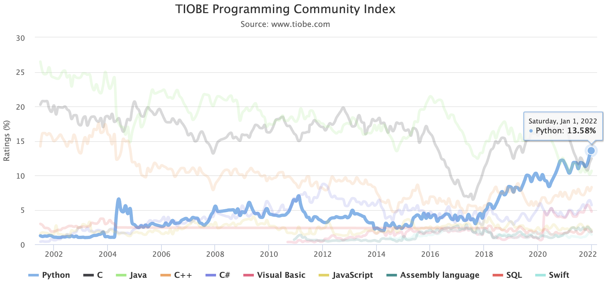
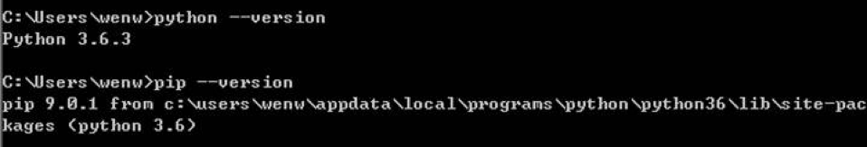
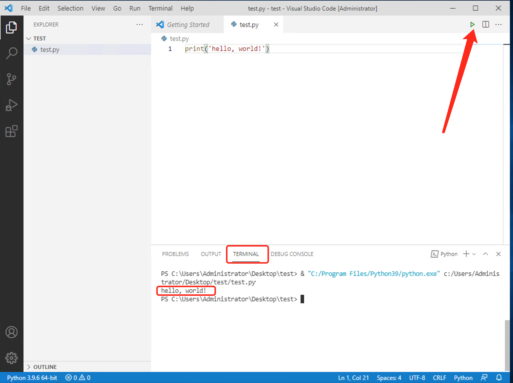
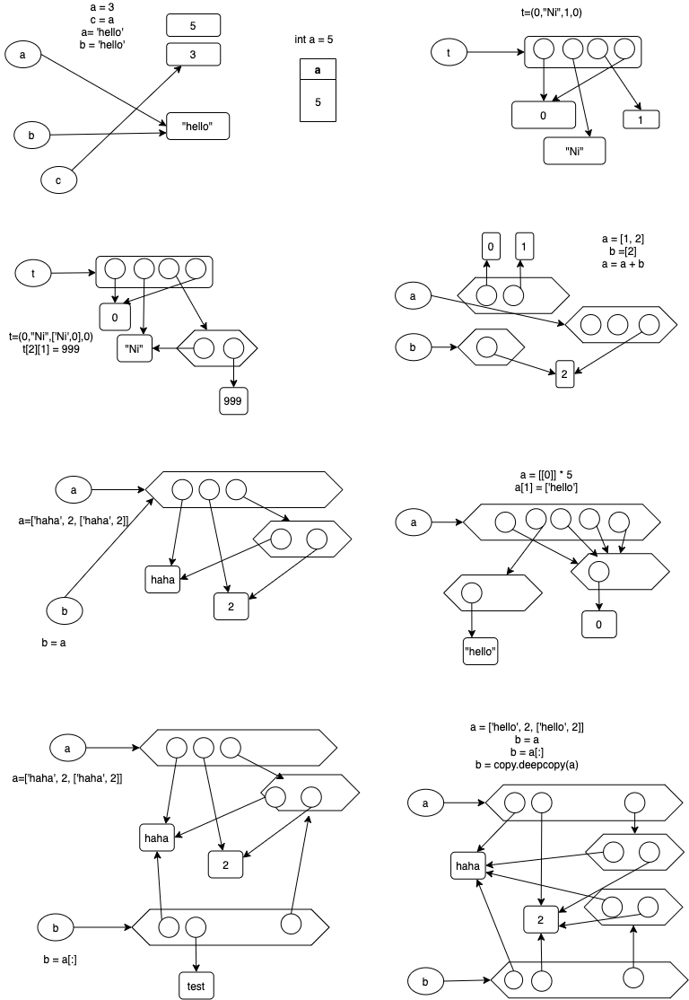
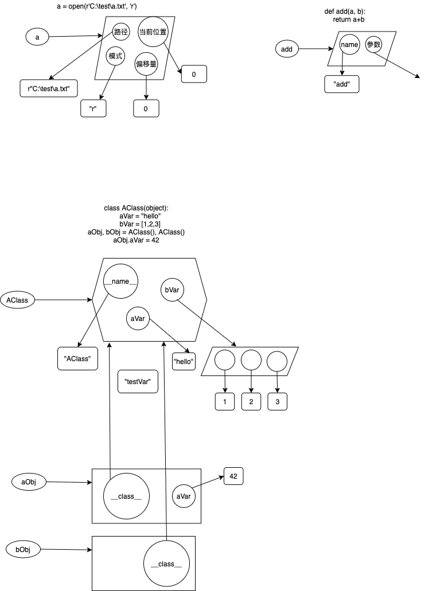
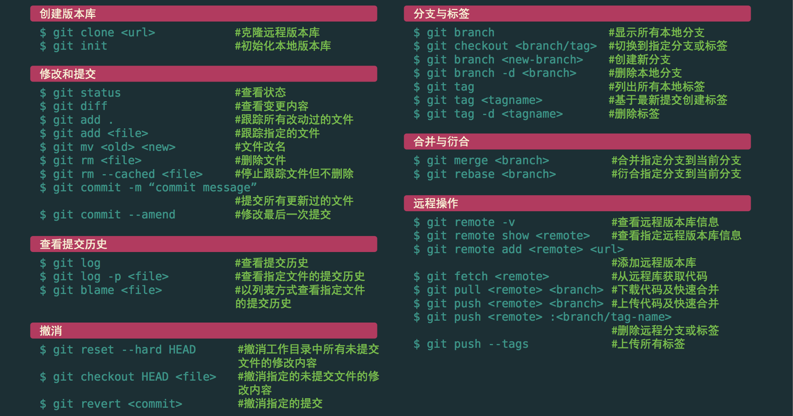
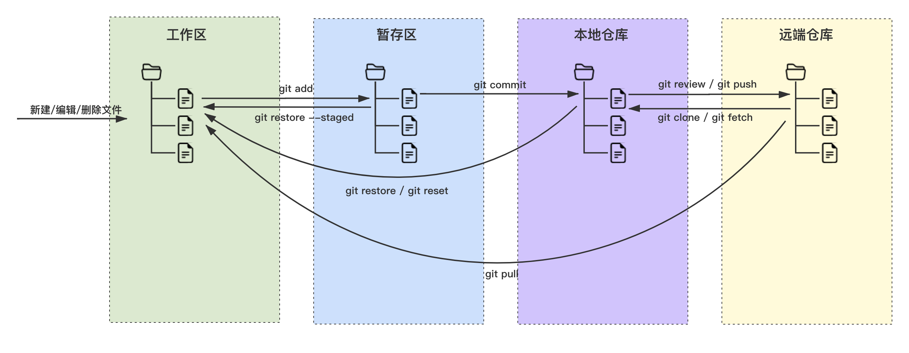
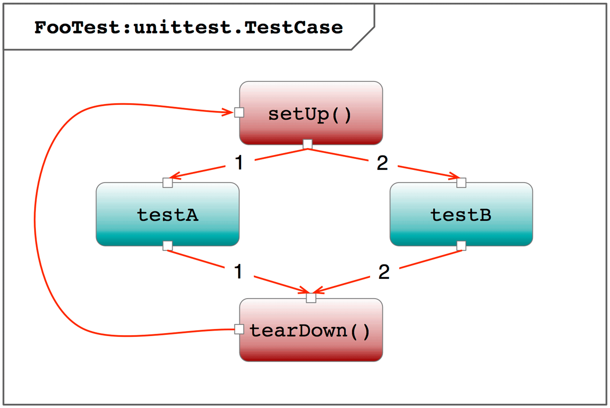
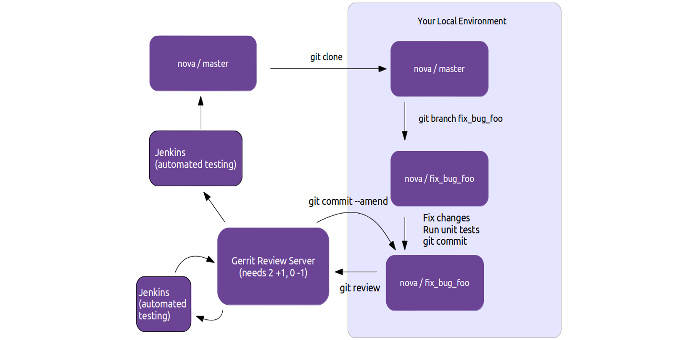

# We know python

## 注意 ⚠️

- _斜体表示引用_
- **未经允许，禁止转载**

## 课程目录

| 日程    | 时间 | 课程               | 内容                                                  |
| ----- | -- | ---------------- | --------------------------------------------------- |
| 第 1 天 | 上午 | [基础](#1-基础)      | [1.1 简介](#11-简介)                                    |
|       |    |                  | [1.2 开发环境搭建](#12-开发环境搭建)                            |
|       |    |                  | [1.3 变量和对象](#13-变量和对象)                              |
|       | 下午 |                  | [1.4 基本对象类型](#14-基本对象类型)                            |
|       |    |                  | [2.1 函数和高阶函数](#21-函数和高阶函数)                          |
| 第 2 天 | 上午 | [进阶](#2-进阶)      | [2.2 类和实例](#22-类和实例)                                |
|       |    |                  | [3.6 使用 AI 工具快速生成代码](#36-使用-ai-工具快速生成代码)            |
|       | 下午 |                  | [2.3 正则表达式](#23-正则表达式)                              |
|       |    |                  | [2.4 异常处理](#24-异常处理)                                |
|       |    |                  | [5.3 设计模式实践](#53-设计模式实践)                            |
| 第 3 天 | 上午 | 应用               | [6.1.1 命令行参数](#611-命令行参数)                           |
|       |    |                  | [6.3 文件和目录](#63-文件和目录)                              |
|       |    |                  | [6.5 数据库对接和 ORM 模型](#65-数据库和-orm)                   |
|       |    |                  | [数据采集](python-exec-public.py#L1483)                 |
|       | 下午 | [Web](#4-web-开发) | [3.1 Git 和 GitOps 运维脚本](#31-版本控制)                   |
|       |    |                  | [4.1 MVC 框架](#41-mvc-框架)                            |
|       |    |                  | [4.2 Restful API](#42-restful-api)                  |
|       |    |                  | [自动化测试](autotest.md)                                |
|       |    |                  | [4.3 服务部署](#43-服务部署)                                |
|       |    |                  | [自动化运维](automation.md#23-ansible-基础)                |
| 第 4 天 | 上午 |                  | [5.4 数据分析](#54-数据分析)                                |
|       |    |                  | [机器学习](http://blog.wuwenxiang.net/Machine-Learning) |
|       | 下午 |                  | [3.2.4 没有 IDE 时的调试技巧](#324-pdb-调试)                  |
|       |    |                  | [3.2.4 应用部署的依赖隔离](#612-部署不同的-python-版本)             |
|       |    |                  | [3.5 模块和发布](#35-模块和打包)                              |
|       |    |                  | [6.1.3 常用标准库和三方库](#613-其它系统相关类库)                    |
|       |    |                  | [6.2 父子进程调用](#62-父子进程调用)                            |
|       |    |                  | [6.4 并行计算](#64-并行计算)                                |

## 1. 基础

[返回目录](#课程目录)

### 1.1 简介

[返回目录](#课程目录)

#### 1.1.1 比较流行的程序语言是哪些？

- TIOBE Index：<https://tiobe.com/tiobe-index/>

  _TIOBE
  编程社区指数是编程语言流行度的一个指标。该索引每月更新一次。评级基于全球熟练工程师的数量、课程和第三方供应商的数量。Google、Bing、Yahoo!、维基百科、亚马逊、YouTube
  和百度等流行搜索引擎用于计算评级。_

  截至 2022 年 1 月，编程语言流行趋势图如下：

  

  _Python 于 2021 年初从 TIOBE 索引的第 3 位开始，将 Java 和 C 抛在后面，成为 TIOBE 索引的第一名。但 Python 的流行并不止于此。目前，它比其他人领先
  1% 以上。Java 在 2001 年创下 26.49% 评级的历史记录还很遥远，但 Python 已经成为许多领域事实上的标准编程语言。没有迹象表明 Python 的胜利行军将很快停止。_

  _Python 有没有真正的竞争者？未来可能会竞争的任何新的闪亮语言？如果我们看看过去几年有前途的语言，我们会看到 2021 年的以下变化：Swift 从 #13 到 #10，Go 从 #14 到
  #13，Rust 从 #26 到 #26，Julia 从 #23 到#28，Kotlin 从 #40 到 #29，Dart 从 #25 到 #37，TypeScript 从 #42 到
  #49。因此，除了 Swift 和 Go 之外，我们预计不会很快有任何新语言进入前 5 名甚至前 3 名。_

- 一种编程语言为什么会流行？
  - 主要原因：**应用广泛（有用）、开发效率高 & 易维护（好用）**
  - 次要原因：性能优异、暂无竞争对手（垄断）

  思考：排名靠前的语言们，它们各自为什么流行？

#### 1.1.2 Python 的起源

- 创始人：[Guido van Rossum](https://baike.baidu.com/item/%E5%90%89%E5%A4%9A%C2%B7%E8%8C%83%E7%BD%97%E8%8B%8F%E5%A7%86/328361)，数学和计算机硕士
- 大龄男青年：1989 年圣诞假期，MAC 笔记本一夜完成
- Python 命名源自 Guido 最英国肥皂剧《Monty Python 马戏团》

#### 1.1.3 什么是 Pythonic 的编程思维？

- **Python 是工程，不是艺术（解决同一个问题用同一种方法）**
  - Python 中的 None 只有一种写法，不能写成 none / null / nul / Null / NONE
  - True/False 也只有一种写法，不能写成 true / TRUE
  - Python 中的分支结构只有 if/else，没有 switch
  - Python 中的 for 循环也只有一种写法 `for i in items: ...`
- **简单优于复杂**
  - Python 只有很少的语法糖，比如装饰器
  - Python 的对象属性设计基本都是可以自圆其说的，包括切片和 range 的开闭区间一致性，装饰器没有黑魔法，for 和 while 中的 else，迭代器的设计，等等。
- **明确优于晦涩**（复杂优于难懂，要始终保持代码的易读性，“让易读的代码进行性能优化”远比“让高效的代码变得易读”要容易）

更具体一点：

- 自顶而下的面向接口的设计
- 恰当地使用数据结构、算法和设计模式
- 代码越少越好（尽量用标准库，代码越少 Bug 越少）
- 尽量减少写复杂的嵌套循环和分支结构，善用解析和高阶函数，把一个复杂的大循环拆成多个简单的小循环

#### 1.1.4 新手应该如何学习编程？

- Eric Raymond 推荐的学习路径：**Python -> Java ->
  C**，参考：[如何成为一名黑客-Eric-S-Raymond.pdf](如何成为一名黑客-Eric-S-Raymond.pdf)
- 选择基础而全面的入门书
  - 官方网站：<http://www.python.org>
  - [Python 学习手册 5th](https://book.douban.com/subject/30364619/)
  - [Python 3 标准库](https://book.douban.com/subject/30346181/)
  - 代码搜索库：<https://www.programcreek.com/python/>
- 到开源项目中去读代码、提交代码

  Python 开源项目非常多，其中 [OpenStack](https://opendev.org/openstack) 是集 Python 工程实现之大成的 IaaS 云计算项目，囊括几乎所有
  Python 的应用相关技术，包括：

  - 基于 MVC 的 Web 网站（Horizon 用了 Django 框架）
  - 基于 Restful API 的 Web Service（Pecan / Webob / Flask / Paste 等框架）
  - Restful API 客户端框架（SDK）
  - 数据库处理（SqlAlchemy）
  - 对接消息队列
  - 对接（缓存处理）
  - 命令行编程
  - 类库打包和动态加载
  - 配置文件解析
  - 日志处理
  - 容器化封装（Kolla）
  - 自动化部署（Ansible）
  - 认证、鉴权和准入
  - 服务注册和服务发现
  - 对接时序数据库
  - 计量和监控（ceilometer 等）
- 程序语言以外的部分
  - 系统（容器、虚拟化）、存储、网络和知识
  - 算法和数据结构
  - 面向对象和设计模式
  - 软件工程和项目管理
- [其它参考资料](/README.md)

### 1.2 开发环境搭建

[返回目录](#课程目录)

#### 1.2.1 Python 如何安装？

参考：[Python 在 Windows 环境上的安装步骤](Installation-Python.md)

> **练习作业**：安装 python。看到下图表示执行成功

> 

> - 图中的 python 版本不一定是 3.6，更高版本亦可
> - 图中的 pip 安装路径也可能不同，不用关注

#### 1.2.2 Python 程序在命令行窗口中如何运行？

- 交互式运行环境：用于 Debug
  - 在命令行中输入 `python`，进入交互环境
  - 交互环境会自动打印出对象的值，比如 `2*3`
  - 退出交互环境：`exit()`，回车
- 运行单行命令：用于和 Shell 命令交互，比如：`python -c "print(3*5)"`
- 运行脚本，比如：`python test.py`

#### 1.2.3 如何用 VSCode 编写和调试 Python 程序？

参考：[用 VSCode 编写和调试 Python 程序](Installation-VSCode.md)

> **练习作业**：在 VSCode 中运行 python 程序。看到下图表示执行成功

> 

#### 1.2.4 Python 体系结构

Python 虚拟机

- Python 虚拟机是安装在操作系统上的软件，用来解析和运行符合Python 语法的命令或者脚本
- 之前安装 python 就是在安装 Python 虚拟机

Python 语法

- Python 程序由**模块**组成，模块由**语句**组成，语句由**表达式**组成，表达式建立和处理**对象**
- 表达式有返回值，语句没有返回值
- Python 语法基于**冒号**和**缩进**，缩进可以选择用 tab 或者空格，但在整个程序中要保持一致

  ```python
  '''
  Check if input-number > 42
  '''
  aStr = input("Input: ")
  # print aStr
  aInt = int(aStr)
  if aInt > 42:
      print("> 42")
  else:
      print("<= 42")
  ```

  - 多行注释：`"""…"""` 或者 `'''…'''`，也是 PyDoc 的写法
  - 标准输入：`input("Prompt string: ")`
  - 单行注释: `#...`
  - 强制缩进 / 所见即所得
  - 没有大括号 / 小括号 / 分号（其实可以有，但会被鄙视）
  - 标准输出：`print(...)`

- python 的分支结构语法（if/elif/else）

  ```python
  if 5 > 3:
      print("5 > 3")
  elif 5 > 4:
      print("5 > 4")
  else:
      print("5 < 4")

  # 三目运算符
  d = 32 if 15 > 14 else 16
  ```

- 比较运算符：`>, >=, <, <=, !=, ==, is`，同类型对象之间的比较有意义，不同类型之间比较无意义。

  == 表示值相等，is 表示引用相同

  支持：4>3>2, 5>4<6>5>3，只要所有相邻两个值关系成立，结果即为 True

  冷知识（用不到，单纯介绍）：序列的比较是从头开始，依次比较每一个元素；集合的比较是：子集/超集；字典的比较是将 key 排序，然后逐个比较 key 值

- 逻辑运算符：not, and, or，存在短路效应
- python 的循环语法

  ```python
  # while 循环
  i = 0
  while i < 10:
      print(i)
      i += 1
  else:
      print(i)

  # for 循环
  for i in range(10):
      print(i)
  else:
      print(i)
  ```

  **注意这里的 else，如果由 break 跳出循环，就不会执行 else block，反之就会执行**

  ```python
  import time
  import random

  i = 0
  timeout_flag = True

  while i < 5:
      r = random.random()
      print(r)
      if r > 0.8:
          timeout_flag = False
          break
      time.sleep(1)
      i += 1

  if timeout_flag:
      print('timeout!')
  ```

  用 else 可以缩减一个变量，效果同前。

  ```python
  import time
  import random

  i = 0

  while i < 5:
      r = random.random()
      print(r)
      if r > 0.8:
          break
      time.sleep(1)
      i += 1
  else:
      print('timeout!')
  ```

#### 1.2.5 帮助文档 Pydoc

- 交互环境：查询 sys 模块的帮助文档：`help(sys)`
- chm 文档（Windows 环境）
- 本地网页，执行 Shell：`python -m pydoc -p 1234`，Web 浏览器访问：<http://localhost:1234>

### 1.3 变量和对象

[返回目录](#课程目录)

#### 1.3.1 变量

- 变量（引用）的概念
  - 变量本身没有类型，对象才有类型，引用可以映射到不同类型的对象
  - 变量要赋值（映射到对象）才能使用
  - **变量只有直接位于等号左边的时候表示为变量建立映射关系，其他时候都表示其映射到的对象本身**
  - 没有被引用映射的对象会被 PVM 的 GC 机制回收
- 变量的命名规则
  - 由字母，下划线，数字组成，且首字符不为数字
  - 区分大小写

#### 1.3.2 对象的属性 attribute

- 字段（field）属性和方法（method）属性
  - 字段属性用来描述对象的特征
  - 方法属性用来表示对象的行为
- 函数和对象的方法属性
  - 关联到特定对象的函数叫方法
  - 不关联到特定对象的通用方法叫函数
- 反射和自省
  - `id()` 函数，可以查看对象在 PVM 中的 hash（身份证号）
  - `__dict__` 属性或者 `dir()` 函数可以查看对象的属性

#### 1.3.3 对象的可变性

- 不可变（Immutable）对象

  包括：整数，浮点数，字符串，元组，不可变集合

  ```python
  aStr = "haha"
  aStr[2] = "e" # Error!
  ```

  对于不可变对象，通常值相等的在PVM中就只保留一份，所以两个值相等的不可变对象，通常其引用也相同。

- 可变（Mutable）对象

  列表，集合，字典

  ```python
  aList = ['h', 'a', 'h', 'a']
  aList = "e" # OK!
  aList.sort()
  ```

#### 1.3.4 在 PVM 中的存储模型

- 数字、字符串、元组、列表

  

- 文件、类

  

#### 1.3.4 对象的复制

- 重映射
  - 等号赋值
  - 实参传递
  - 函数返回值
- 浅拷贝
  - `copy.copy(aObj)`
  - 绝大多数运算符运算之后都会生产新的对象，比如序列的切片，加法，乘法
  - 对可变对象，`+=` 需要注意（它改变原对象）
- 深拷贝
  - `copy.deepcopy(aObj)`

### 1.4 基本对象类型

[返回目录](#课程目录)

参考：<https://docs.python.org/3/library/stdtypes.html>

#### 1.4.1 整数对象（int）

- 整数对象的写法
  - 默认为十进制：`42`
  - 也可以用八进制或者十六进制书写：`0o52`，`0x2a`
  - 可以认为 Python 中能处理的最大整数只取决于该机器的内存
- 基本运算：加减乘除，乘方，整除，取余：`+ - * / ** // %`
  - Python 2 中 `/` 是整除：`5/2 -> 2`
  - python 3 中 `/` 是小数除法：`10/2 -> 5.0`
- 取整运算

  ```python
  截尾取整 int(3.54) -> 3
  向上取整 math.ceil(3.14) -> 4
  向下取整 math.floor(3.14) -> 3
  四舍五入 round(3.14) -> 3, round(3.54) -> 4
  ```

- 字符串转换成整数

  ```python
  按十进制转换
  int("12") -> 12

  按八进制转换
  int("12", 8) -> 10

  按十六进制转换
  int("12", 16) -> 18
  ```

- 整数转换成字符串

  ```python
  转换成十进制形式
  str(12) -> "12"
  "%d" % 12 -> "12"

  转换成八进制形式
  oct(12) -> "014"
  "%o" % 12 -> "14"

  转换成十六进制形式
  hex(12) -> "0xc"
  "%x" % 12 -> "c"
  "%X" % 12 -> "C"
  ```

#### 1.4.2 浮点数对象（float）

- 浮点数对象的写法，带小数点：`3.1415`
- 浮点数的基本运算：加减乘，乘方：`+  -  *  **`
- 浮点数的除法
  - 浮点数和整数一起运算，返回浮点数：`5.0 / 2`
  - Floor 除法：结果是不大于商的最大整数

    ```python
    5 // 2 -> 2
    5 // -2 -> -3
    ```

- 数字的常用函数

  ```python
  int(x)
  float(x)
  divmod(x, y)
  pow(x, y)
  round(x, n)
  abs(x)

  sum(seq)
  max(seq)
  min(seq)

  eval(aStr)
  ```

- 数字的常用标准库

```python
>>> import math
>>> math.pi
3.141592653589793
>>> math.sqrt(2)
1.4142135623730951

>>> import random
>>> random.random()
0.4982889444815377
>>> random.choice([1, 2, 5, 7])
5
>>> random.randint(0,10)
2
```

> **练习作业**：随机生成两个 10 以内的实数（精确到小数点后两位）并输出到屏幕，要求用户输入它们的和，然后判断用户的输入值，然后输出 True/False。

> ```python
> 程序运行后界面上显示 Please input sum for 4.96 + 4.91 =
> 然后用户输入 9.87
> 程序输出 True
> ```

> [参考](python-exec-public.py#L117-138)

#### 1.4.3 字符串（str）

- 引号
  - 单引号和双引号效果一样，但是都要成对使用
  - 单双引号可以相互嵌套，以避免使用转义

    ```python
    print('isn\'t')
    print("isn't")
    ```

  - 三个单引号或者双引号可以产生多行字符串
- 单行内容太长，分行输入

  ```python
  h1 = "haha \
        Ok"
  h2 = ("haha"
        "xixi")
  ```

- 转义符：`\', \", \\, \n, \t, \b`
- 原始字符串（不转义）

  ```python
  print(r't\nt')
  print('t\\nt')
  ```

- 二进制字符串（）

  ```python
  >>> '测试'.encode()
  b'\xe6\xb5\x8b\xe8\xaf\x95'
  >>> '测试'.encode('utf-8')
  b'\xe6\xb5\x8b\xe8\xaf\x95'
  >>> '测试'.encode('cp936')
  b'\xb2\xe2\xca\xd4'
  >>> b'\xb2\xe2\xca\xd4'.decode('cp936')
  '测试'
  ```

- 加法和乘法

  ```python
  "hello " + "world!"
  "-" * 20
  ```

- 切片 Slice

  ```python
  aStr = "hello, world!"
  print(aStr[0], aStr[-1])
  print(aStr[2:-1]) # 左闭右开
  print(aStr[2:], aStr[:2], aStr[None:2])
  print(aStr[::2], aStr[-1::-1], aStr[::-1])
  ```

- 字符串的常用方法

  ```python
  replace
  count
  find/index
  capitalize/title
  isalpha/isdigit/isalnum
  isspace
  split
  join
  endswith/startswith
  lower/upper
  strip/rstrip/lstrip
  ```

- 字符串常用函数和操作

  ```python
  len("haha")

  chr(70)
  ord('F')

  for x in "hello":
      print(x)

  if "he" in "hello":
      print(True)
  ```

- 格式化字符串

  ```python
  "%d %s" % (5, "world")
  "%06.2f" % 3.1415 # 这里的 0 还可以是 +, -, 空格
  # 格式化输出的种类 %s, %r, %c, %d, %i, %u, %o, %x, %X, %e, %E, %f, %g, %G, %%

  '{1},{0},{1}'.format('kzc',18)
  '{a},{b}'.format(a=18,b='kzc')

  a, b, c = 1, 2, 3
  f'{a} + {b} = {c}'
  ```

> **练习作业**：提示用户输入一个字符串，判断该字符串是否回文（回文是指正读反读都一样，比如 accbcca / 123321 是回文）。

> [参考](python-exec-public.py#L252-271)

> **练习作业**：提示用户输入一个句子，去掉行首行末的空白，单词之间的空白统一格式化成一个空格。

> ```python
> 输入 "It is      my  book. "
> 输出 "It is my book."
> ```

> [参考](python-exec-public.py#L234-251)

#### 1.4.4 元组（tuple）

- 元组的初始化

  ```python
  t = (0, "Ni", 1, 0)
  t = (0,) # 单元素元组的末尾要加上逗号，以区别括号运算符，这里若没有逗号就等于0
  t = (0, "Ni", 1, (4, 5,)) # 元组可以嵌套另一个元组或者其它任意对象
  t = tuple("hello") # 从其它可迭代对象生成元组
  ```

  元组赋值：`a,b,c = 1,2,3`

- 元组是**不可变的引用序列对象**
  - 元组是序列，序列元素是引用（临时变量）
  - 元组是不可变对象
- 元组赋值运算

  ```python
  >>> a, b = 4, 5
  >>> (a, b) = 4, 5
  >>> a, b = (4, 5)
  >>> (a, b) = (4, 5)
  >>> (a, b) = (b, a+b)
  >>> a, b = b, a+b
  >>> a, b = divmod(5, 3)
  ```

- 序列的通用表达式和函数

  ```python
  if x in s / if x not in s

  if "ha" in "haha":
      print(True)

  for x in s:
      print(x)

  s + t, s += t
  "hello" + " world!"
  对可变序列对象，s+=t会改变s对象本身

  s * n, n * s
  "hello" * 5

  s[i], s[i:j], s[i:j:k]
  len(s), min(s), max(s)

  sorted()
  sorted([1, 4, 3, 2]) # 排序后生成一个新的列表并返回
  ```

#### 1.4.5 列表（list）

- 列表的初始化

  ```python
  t = [0, "Ni", 1, 3]
  t = [0, "Ni", 1, [4, 5]] # 列表可以嵌套另一个列表或者其它任意对象
  t = list("haha") # 从其它可迭代对象生成列表
  t = list(range(3)) # 生成数字列表：[0, 1, 2]
  ```

- 列表是可变的引用序列对象
  - 列表是序列，序列元素是引用（临时变量）
  - 列表是可变对象
- 列表常用方法

  ```python
  # append / extend
  aList = [1, 3, 2, 4, 7, 6]
  aList.append([4, 5]) # 不生成新的列表对象，而是改变原对象本身
  aList.extend([4, 5])

  # sort
  aList.sort()

  # insert
  aList.insert(1, 4)

  # reverse
  aList.reverse()

  # pop / remove
  aList.pop() # 删除并返回最后一个元素
  aList.remove(1) # 删除指定的元素，没有返回值
  ```

- 列表常用运算

  ```python
  # del L2[i:j]
  del aList[2]
  del aList[0: 1] # 删除变量和映射关系，而非删除对象本身

  # L2[k] = N / L2[i:j] = L3
  aList[2] = 5 # k不可以越界访问
  aList[1:2] = [4, 5, 6] # 等号左边的索引仍然代表一个左闭右开的区间，等号右边的列表表示填入的内容。

  zip()将多个列表合成一个元组对列表
  list(zip([1, 2, 3], ["apple","pear","banana"]))
  ```

- 列表解析

  列表解析的本质是：

  - 遍历可迭代对象的每一个元素
  - 将遍历到的元素代入前端的表达式进行运算
  - 用运算结果生成一个新的列表对象

  列表解析举例

  ```python
  [i**2 for i in range(5)]
  [str(i) for i in range(5) if i > 3]
  [ord(i) for i in "hello"]
  ```

> **练习作业**：提示用户输入若干（>3）个评分，去掉一个最高分，一个最低分，求平均分，保留2位小数。

> ```python
> Please input some integer numbers:
> 9 7 5 0 100
> The average is: 7.00.
> ```

> [参考](python-exec-public.py#L320-338)

> **练习作业**：提示用户输入一个整数，输出比它小的能被三整除的自然数。

> ```python
> Please input a integer:
> 50
> 3 6 9 12 15 18 21 24 27 30 33 36 39 42 45 48
> ```

> [参考](python-exec-public.py#L453-466)

> 思考题：

> ```python
> a = [[0]] * 3
> a[0][0] = 1
> print(a) # 结果是？
> ```

> 进一步思考下以下两者的区别：

> ```python
> a = [0]
> [a for i in range(3)]
> [[0] for i in range(3)]
> ```

#### 1.4.6 序列和散列

序列和散列都是可迭代对象

- 序列包括：字符串/元组/列表
  - 元素有序排列
  - 元素可以重复
- 散列包括：集合/不可变集合/字典
  - 元素没有顺序
  - 元素（键）不可以重复

#### 1.4.7 集合（set）

- 集合的初始化

  ```python
  x = set("hello") # 从其它可迭代对象生成集合
  ```

- 集合表示一些元素的无序集合

  无重复元素，可以用于剔除序列中的重复元素

- 集合只能包含可以计算哈希值的对象（hashable）

  Python 内建的不可变对象都是 hashable 的，元组是 hashable 的，列表不是

  ```python
  >>> set([list(range(5)), list(range(3))])
  Traceback (most recent call last):
  File "<stdin>", line 1, in <module>
  TypeError: unhashable type: 'list'
  ```

- 集合的常用运算

  ```python
  x - y # 差集
  x & y # 交集
  x | y # 并集
  x ^ y # 外集
  x < y # 真子集
  x <= y # 子集
  x >= y # 超集
  ```

- 集合的常用方法

  ```python
  aSet.update(bSet)
  aSet.intersection_update(bSet)
  aSet.difference_update(bSet)
  aSet.symmetric_difference_update(bSet)
  aSet.add(x)
  aSet.remove(x)
  aSet.discard(x) # remove if exist
  aSet.pop()
  aSet.clear()
  ```

- 不可变的集合（frozenset），不可变对象

  frozenset 和 set 的关系，相当于 tuple 和 list 的关系

> **练习作业**：translations 由哪些不同的字母组成？

> **练习作业**：smiles 和 translations 这两个单词有哪些共有字母（s/i/l），哪些独有的字母（比如 smile 有 m/e）？

#### 1.4.8 字典（dict）

- 字典的初始化

  ```python
  aDict = {'apple': 1.5, 'pear': 2.3}
  aDict = dict(apple = 1.5, pear = 2.3)
  aDict = dict([("apple",1.5), ("pear",2.3)])
  ```

- 键只能是 hashable 的对象，不能重复，通常用字符串或者数字
- 值可以是任意对象，可以重复
- 字典的常用方法

  ```python
  aDict.items()
  aDict.keys()
  aDict.values()
  aDict.copy()
  aDict.get(k[,x])
  aDict.setdefault(k[,x])
  aDict.pop(k[,x])
  aDict.clear()
  ```

- 字典的常见运算
  - 访问字典中的元素

    ```python
    aDict = {"apple":1.5, "banana":2.4}
    print(aDict["apple"])
    print(aDict["pear"]) # 访问不存在的键会报错
    ```

  - 添加一个元素

    ```python
    aDict["pear"] = 3.2
    ```

  - pprint.pprint，用于 Debug 时更清晰地 Dump 复杂对象
  - 基于字典的格式化

    ```python
    "%(n)d %(x)s %(n)d" % {"n":1, "x": "spam"}
    '{a},{b}'.format(a=18,b='kzc')

    aDict = {"n":1, "x": "spam"}
    f'{aDict["n"]} {aDict["x"]}'  # '1 spam'
    ```

> **练习作业**：提示用户输入一行字符串，统计并输出其中每个字符出现的次数。

> ```python
> Please input a Str:
> abcdcdabcd
> The stat char list:
> a => 2
> c => 3
> b => 2
> d => 3
> ```

> [参考](python-exec-public.py#L468-497)

- 散列的通用运算

  ```python
  # if x in hash / if x not in hash
  if "h" in set("ha"):
      print(True)
  if "h" in aDict:
      print(True)   # 判断 aDict 中是否有 "h" 这个键

  for x in h:
      print(x)

  len(s), min(s), max(s)

  sorted # 对散列元素排序后生成一个列表
  sorted(set(1, 4, 5))
  sorted(aDict)
  ```

#### 1.4.9 其它基本对象类型

- 布尔变量
  - True / False
  - any(s) / all(s)
- None
  - 是函数/方法的默认返回值

## 2. 进阶

[返回目录](#课程目录)

### 2.1 函数和高阶函数

[返回目录](#课程目录)

#### 2.1.1 函数的定义和调用

- 函数对象的属性
  - 函数名称：`__name__`
  - 输入参数（个数和默认值）
  - 函数体
  - 返回值
  - 函数文档：`__doc__`
- 函数定义的过程
  - 产生一个函数对象
  - 将这个函数对象和函数名变量建立映射关系
  - 多次定义同名函数，则后定义的会简单覆盖前面的

    ```python
    def add(a, b=3):
        """
        add function
        >>> add(4, 5) 9
        """
        return a + b

    print(add.__name__)
    print(add.__doc__)
    print(add(4, 5), add(7))
    ```

- 函数内的变量访问规则
  - LEGB：Local/Enclosed/Global/Built-in
  - 凡是函数内有赋值运算的变量就是 local 变量
  - 如果确实要在函数中修改全局变量，需要用 global 修饰符

  > 思考题（以下代码的运行结果是？）：

  ```python
  a = 42

  def aFun():
      a += 1

  aFun()
  print(a)
  ```

- 命名空间用来避免变量名冲突
  - 函数对象：局部变量
  - [模块对象](#351-模块)：模块的属性（模块中的全局变量和函数）
  - 类对象：类的属性（字段和方法）
  - 实例对象：实例的属性（字段和方法）
- 函数的实参写法
  - 普通传参 `add(4, 5)`
  - 命名传参 `add(b=5, a=4)`
  - 元组传参 `add(*(4, 5))`
  - 字典传参 `add(**{'a':4, 'b':5})`
- 函数的形参写法
  - 序列变长参数 `def echo(*args): print(args)`
  - 字典变长参数 `def echo(**kwargs): print(kwargs)`
  - 形参顺序
    - 非默认参数要放在默认参数前面
    - 定长参数列表要放在变长参数前面

      ```python
      def echo(arg, *args):
          print(arg, args)
      ```

    - 序列变长参数要放在字典变长参数前面

      ```python
      def echo(arg, *args, **kwargs):
          print(arg, args, kwargs)
      ```

  - 默认参数

    **注意：默认参数的值在函数定义时确定**

    > 思考题（以下代码有什么问题？）：

    ```python
    import time

    def myLog(msg, timestamp=time.time()):
        print(f'[{timestamp}]::{msg}')

    myLog("test")
    time.sleep(2)
    myLog("test", time.time())
    ```

    **注意：默认参数的值尽量不要是可变参数**

    > 思考题（以下代码有什么问题？）：

    ```python
    import time

    def addItem(aList=[], i=42):
        aList.append(i)
        return aList

    print(addItem([1,2,3], 4))
    print(addItem())
    ```

- 函数的参数和返回值
  - 参数传递和接收返回值的本质都是映射关系的建立
    - 参数传递本质上就是将实参对象和形参变量建立映射关系
    - 接收返回值本质上就是将返回值对象和接收返回值的变量建立映射关系
    - 如果希望传入参数和函数外部的逻辑解耦，需要传入实参的浅拷贝或者深拷贝。
  - 返回值可以是多个，但本质上是一个元组
    - `return 3,5` == `return (3,5)`
    - `a, b = fun()` == `aTuple = fun(); a, b = aTuple`

#### 2.1.2 高阶函数

- Lambda 函数

  ```python
  fun = lambda x: x**2

  fun(3)
  (lambda x: x ** 2)(3)
  ```

  lambda 的使用场合

  - 定义只用一次的简单函数
  - 尤其用于 callback 场合

- 回调函数

  回调 callback 的定义

  - 回调本质上是将函数对象 A 作为一个参数传递给另一个函数或方法 B 。
  - B函数被调用时，会在函数体中调用 A 函数对象

  因为 A 函数对象是在运行时作为实参动态传递给B函数，所以 B 函数在定义时并不知道 A 函数的具体信息

  回调函数的适用场合

  - 事件驱动编程模型，比如 [TK-GUI](python-exec-public.py#L1512-1550)
  - 异步编程模型

- map

  `map(fun, aIter[, bIter...])`

  map函数的本质

  - 第一个参数是函数对象，后续参数是一个或多个可迭代对象
  - 会将可迭代对象的每一个元素作为参数传递给函数对象，并将返回值组 合成一个生成器返回

  举例

  - `map((lambda x:x+10), range(5))`
  - `map(pow, [1, 2, 3], [2, 3, 4])`

- filter

  `filter(fun, iters)`

  filter函数的本质

  - 第一个参数是函数对象，第二个参数是一个可迭代对象
  - 会将可迭代对象的每一个元素作为参数传递给函数对象，并将返回值为 True的可迭代对象组合成一个生成器返回

  举例

  - `filter((lambda x: x>0), range(-5,5))`
  - `filter(lambda x: sum(x) > 10, zip([5, 6, 7], [4, 5, 6]))`

- reduce

  ```python
  from functools import reduce
  reduce(fun, iters[, initial])
  ```

  reduce函数的本质

  - 第一个参数是函数对象，第二个参数是一个可迭代对象，第三个可选参数是初始值
  - 无初始值

    ```python
    reduce(lambda x,y: x+y, [1,2,3,4,5]) -> ((((1+2)+3)+4)+5)
    reduce(lambda x,y: x+y, []) -> TypeError
    ```
  - 有初始值

    ```python
    reduce(lambda x,y: x+y, [1,2,3,4,5], 10) -> (((((10+1)+2)+3)+4)+5)
    reduce(lambda x,y: x+y, [], 10) -> 10
    ```

  > **练习作业**：实现一个函数sumAny，能满足如下运算：(参数个数是两个或多个，参数彼此之间能做+运算)。

  ```python
  print(sumAny(1, 2))
  print(sumAny(1.2, 2.3, 3.4))
  print(sumAny("hello, ", "world!"))
  print(sumAny([0,1,2,3,4], [0,1,2])
  ```

  输出：

  ```
  3
  6.9
  hello, world!
  [0, 1, 2, 3, 4, 0, 1, 2]
  ```

  [参考](python-exec-public.py#L795-818)

- 其它
  - sort/sorted/key

    `sorted(['10','apple','e'], key=len)`

    ```python
    fruits = {
        'apple': 5.8,
        'pear': 4.5,
        'orange': 5.7,
        'banana': 3.9,
        'mango': 8.9,
        'watermelon': 12.7,
        'cherry': 8.9,
    }

    for k in sorted(fruits, key=lambda x:fruits[x]):
        print(f'{k}\t=>\t{fruits[k]}')
    ```

    ```python
    tests = ['apple', 'pear', 'banana', 'mango', 'test', 'temp', 'tuple']

    def mySort(aList, key=lambda x: x):
        aList = list(aList)
        for i in range(len(aList)):
            for j in range(i + 1, len(aList)):
                if key(aList[i]) > key(aList[j]):
                    aList[i], aList[j] = aList[j], aList[i]
        return aList


    print(mySort([1, 0, 2, 3, 6, 5, 4]))
    ```

  - min/max 等

    ```python
    min(fruits, key=fruits.get)
    ```

  - 偏函数：为函数对象设置新的默认参数（返回值是函数）

    ```python
    def int2(x, base=2):
        return int(x, base)

    >>> int2('1000000')
    64
    >>> import functools
    >>> int2 = functools.partial(int, base=2)
    >>> int2('1010101')
    85
    ```

    ```python
    def partial(func, **defaults):
        def newFun(*args, **kwargs):
            defaults.update(kwargs)
            return func(*args, **defaults)
        return newFun

    int2 = partial(int, base=2)
    print(int2('1111100000'))

    >>> aDict = {'test1': 1, 'test2': 2}
    >>> bDict = {'test2': 3, 'test4': 4}
    >>>
    >>> aDict.update(bDict)
    >>> aDict
    {'test1': 1, 'test2': 3, 'test4': 4}
    >>> {**aDict, **bDict}
    {'test1': 1, 'test2': 3, 'test4': 4}
    ```

### 2.2 类和实例

[返回目录](#课程目录)

#### 2.2.1 类的定义和实例化

```python
class AClass(object):
    """
    AClass Spec

    This a AClass
    """
    aField = "testField"
    def aMethod(self):
        print("testMethod")

print(AClass.__name__)
print(AClass.__doc__)
print(AClass.__dict__)
print(AClass.__base__)
```

- 类对象的属性
  - 类名称: `__name__`
  - 类文档: `__doc__`
  - 类的属性字典: `__dict__`
  - 类的第一个父类: `__base__`
- 类定义的过程
  - 产生一个类对象
  - 将这个类对象和类名变量建立映射关系
  - 多次定义同名类，则后定义的会简单覆盖前面的
- 新式类/经典类
  - Python 3 中默认是新式类
  - 在 Python 2 中，新式类需要继承 object，经典类不继承 object

```python
class AClass(object):
    aVar = "testVar"
    bVar = [1,2,3]
aObj, bObj = AClass(), AClass()

print(aObj, bObj)
print(aObj.__class__, bObj.__class__)
print(aObj.aVar, aObj.bVar)

aObj.aVar = "newString"
print(aObj.aVar, bObj.aVar, AClass.aVar)

aObj.bVar[2] = "newItem"
print(aObj.bVar, bObj.bVar, AClass.bVar)

aObj.newVar = "newVar"
# AClass.newVar = "newVar"
print(aObj.newVar, AClass.newVar)
```

- 实例化的本质

  以类对象为模版，生成实例对象的过程

  ```python
  str(object='') -> string
  >>> str()
  ''
  >>> str(42)
  '42'
  ```

- 实例对象的属性
  - 类信息: `__class__`
  - 访问实例对象的属性时，如果发现没有，会去它的类对象中查找
  - 实例对象可以有自己的属性，并且可以动态增加
- _**[了解即可] 伪私有属性**_

  属性的访问权限

  - 私有属性：只能在其所属类的代码中被调用
  - 公有属性：能在所属类以外的代码中被调用

  私有属性的作用

  - 约束类库的接口
  - 增加类库代码的安全性
  - 确保客户端代码的兼容性

  伪私有属性

  - Python中所有的属性都是公有的
  - 为了约束接口，Python增加了伪私有属性：在定义类时，以双下划线为前缀的属性即为伪私有属性。Python会自动帮你加上类前缀。
  - 注意：在定义好类之后，再添加以双下划线为前缀的属性，不是伪私有属性。
- 方法属性
  - 类的方法属性本质上都是成员方法
  - 成员方法带有一个 self 参数，并位于形参列表的第一位
  - self 代表的就是类的实例对象

  特殊的方法属性

  - 类方法 `@classmethod`
  - 静态方法 `@staticmethod`
  - 属性 `@property`

#### 2.2.2 钩子方法和运算符重载

- 钩子方法（Hook）/ 魔术方法（Magic method）

  Hook 方法通常不会被直接 call 到，而是被绑定在其它方法或者运算符上

  ```python
  3+5 -> (3).__add__(5)
  str(3) -> (3).__str__()
  ```

- 运算符重载

  除了显示的运算符，隐式的运算也被包含在运算符重载的范畴中，比如实例化，点号运算，括号运算等都算在内。

  - 初始化方法: `__init__`

    ```python
    class Test(object):
        def __init__(self, param):
            self.param = param
        def testMethod(self):
            print(self.param)

    a = Test("haha")
    a.testMethod()
    ```

  - 字符串方法：`__str__` 和 `__repr__`

    ```python
    class Test(object):
        def __str__(self):
            return "str"
        def __repr__(self):
            return "repr"

    a = Test()
    print(a, str(a), repr(a))
    ```

    `str()` 和 `print` 在找不到 `__str__` 方法会去找 `__repr__`，`repr()` 则不会找 `__str__`，所以应该优先实现 `__repr__`
    方法。

  - 点号运算符（访问属性）：`__getattr__`

    ```python
    class Test(object):
        def __init__(self, param):
            self.param = param
        def __getattr__(self, param):
            print(param + "not found!")

    a = Test("haha")
    print(a.param)
    a.dddd
    ```

  - 括号运算符（函数调用）：`__call__`

    ```python
    class A(object):
        def __call__(self):
            return 42

    a = A()
    print(a())
    ```

    与函数相比，实例对象有什么优势？

    - 纵向扩展：类的继承
    - 更好的封装：可以将子函数封装成类的成员方法

    “闭包”和类

    ```python
    def addN(n):
        def add(x):
            return x+n
        return add

    class addN(object):
        def __init__(self, n):
            self.n = n
        def __call__(self, x):
            return x+self.n

    add3, add4 = addN(3), addN(4)
    print(add3(42), add4(42))
    ```

  - 其它运算符重载

    ```python
    __new__
    __cmp__
    __index__
    __lt__, __le__, __gt__, __ge__, __eq__, __ne__
    __add__, __sub__, __mul__, __div__
    __del__
    ```

- 动态属性
  - 为类对象动态绑定属性，影响所有的实例
  - 为实例对象动态动态绑定属性，影响单一实例

  属性绑定: `__slot__`

  ```python
  class Student(object):
      __slots__ = ('name', 'age')
  s = Student()
  s.name = 'Michael'
  s.age = 25
  s.score = 99 # AttributeError
  ```

  slots 定义的属性仅对当前类起作用，对继承的子类是不起作用的，除非在子类中也定义 slots，这样子类允许定义的属性就是自身的 `__slots__` 加上父类的 `__slots__`。

#### 2.2.3 继承和组合

- 继承的意义
  - 子类获得父类所有的属性和方法
  - 分层抽象，结构明确
- 继承树

  ```
  子类：       child
              /    \
      father_1    father_2
      /       \    /    \
  ff_1    ff_2  gg_1   gg_2
  ```

- 多继承时的属性查找顺序
  - 子类中属性或方法的查询顺序：由上而下，从左到右。
  - 若查完整棵树没有找到，抛出异常。
  - 经典类深度优先，由左及右。新类广度优先。
- 类继承中的常用方法

  isinstance 用于判断一个对象的类型

  ```python
  >>> isinstance(1, int)
  True
  >>> isinstance(1, (int, str))
  True
  ```

  super

  ```python
  # 用于在新式类中调用父类方法
  # 实际不止是在调用父类方法那么简单

  class AClass(object):
      def __init__(self):
          print("Aclass")

  class BClass(AClass):
      def __init__(self):
          super().__init__()
          print("BClass")
  bVar = BClass()
  ```

- [继承优于组合的例子](python-exec-public.py#L1046-1066)
- [组合优于继承的例子](python-exec-public.py#L1068-1092)

#### 2.2.4 面向对象的案例

##### 2.2.4.1 问题分析

需要解决的问题：[四个程序员的一天](https://blog.csdn.net/justjavac/article/details/8224055)

- 接口要求
  - 客户端输入：运算逻辑和两个运算数
  - 客户端输出：运算结果
- 什么是扩展性好的代码？
  - 符合开放-封闭原则：服务端代码对扩展开放，对修改封闭
- 如何编写扩展性好的代码？
  - 将运算逻辑也实现成一个对象，不同的运算逻辑是不同的运算类的实例对象
  - 添加新的运算逻辑就是添加新的运算类（横向扩展），运算类的扩展也可以通过继承来实现（纵向扩展）

##### 2.2.4.2 实现分析

对比前四种代码：

- C++：运算逻辑是**字符串（更通用的接口）**
  - **没有将运算逻辑实现成对象，所以也不支持运算逻辑的继承**
  - **没有解耦客户端和服务端代码，也不符合开放-封闭原则**
- Java：运算逻辑是**实例对象**
  - 服务端代码符合开放-封闭原则
  - 将运算逻辑实现成运算类的实例对象，支持运算逻辑的继承
- C#：运算逻辑是**函数对象**
  - 服务端代码符合开放-封闭原则
  - 将运算逻辑实现成运算函数对象（委托），**不能继承**
- Schema：运算逻辑是内置函数对象
  - 直接使用语言自带的运算逻辑对象，**不能继承，不能扩展**

结论：

- 这个故事本身杀鸡用牛刀……
- 但**就面向对象而言，Java 才是最接近的答案**

##### 2.2.4.3 Python 的实现

如果不考虑扩展：

```python
# 客户端代码：
int.__add__(3,5)
```

如果要更通用的接口（运算逻辑用字符串表示）：

```python
# 服务端代码：
def OptProxy(opt, a, b):
	  return (a.__class__.__dict__[opt])(a,b)
# 客户端代码：
print(OptProxy("__add__", 5, 3))
```

如果在字符串接口基础上要可以扩展，面向对象：简单工厂模式

```python
# 服务端代码
class OptBase(object):
    def __call__(self):
        raise NotImplemented

class OptAdd(OptBase):
    def __call__(self, arg1, arg2):
        return arg1 + arg2

class OptSub(OptBase):
    def __call__(self, arg1, arg2):
        return arg1 - arg2

# 简单工厂
def OptFactory(optStr):
    if optStr == "Add":
        return OptAdd()
    elif optStr == "Sub":
        return OptSub()

# 客户端代码
if __name__ == "__main__":
    opt = OptFactory("Add")
    print(opt(3, 5))
    opt = OptFactory("Sub")
    print(opt(3, 5))
```

简单工厂模式的缺点：不符合封闭-开发原则

进一步改进：反射和自省代替 `if-else`

```python
selfMod = __import__(__name__)
def OptFactory(optStr):
    return (selfMod.__dict__["Opt"+optStr])()
```

设计模式相关内容，可以参考 [5.3 设计模式实践](#53-设计模式实践)

### 2.3 正则表达式

[返回目录](#课程目录)

正则表达式是最犀利的字符串处理工具。以 Perl 语言的正则表达式规范为基础形成的正则表达式 POSIX 标准，被广泛应用于各种语言和各种场合。

- 模式匹配的步骤
  - 模式编译
  - 模式匹配
- Search vs Match
  - 模式能匹配到字符串的子串时，Search 返回 True，否则返回 False
  - 模式从字符串开始处匹配，Match 返回 True，否则返回 False

    ```python
    import re

    reCmp = re.compile("\d{3,5}")
    if reCmp.search("http404"):
        print("Match!")
    else:
        print("Non-Match!")

    if reCmp.match("http404"):
        print("Match!")
    else:
        print("Non-Match!")
    ```

- 正则表达式规则

  ```
  . 换行以外的任意字符
  + 前面一个元素出现一次或多次
  * 前面一个元素出现零次或多次
  {x, y} 前面一个元素出现[x, y]次之间
  [] 选择框
  [a-z0-9_+]
  [^A-Z]
  ^ 开头
  $ 结尾
  ? 前面一个元素出现零次或一次
  () 组合框
  (ab)+
  | 或
  A|B
  \ 转义
  \\, \w, \s, \d, \b, \W, \S, \D, \B
  ```

  ```
  I  IGNORECASE
  Perform case-insensitive matching.

  L  LOCALE
  Make \w, \W, \b, \B, dependent on the current locale.

  M  MULTILINE
  "^" matches the beginning of lines (after a newline) as well as the string. "$" matches the end of lines (before a newline) as well as the end of the string.

  S  DOTALL
  "." matches any character at all, including the newline.

  U  UNICODE
  Make \w, \W, \b, \B, dependent on the Unicode locale.
  ```

- 贪心和非贪心匹配

  `*?`, `+?`, `??`, `{m,n}?`

  ```python
  >>> reCmp = re.compile("(.+?)(.+)")
  >>> reObj = reCmp.search("Hello")
  >>> reObj.groups()
  ('H', 'ello')
  >>> reCmp = re.compile("(.+)(.+)")
  >>> reObj = reCmp.search("Hello")
  >>> reObj.groups()
  ('Hell', 'o')
  ```

- 标记匹配

  ```python
  >>> reCmp = re.compile(r"(\d)(\s+)\1")
  >>> reCmp.search("2 2")
  <_sre.SRE_Match object at 0x10fe6a690>
  ```

- 取得匹配值

  ```python
  line = "Code: A127Z"
  match= re.search('(\w)((\d{3})(\w))', line)
  items = match.groups()
  # 按左括号的先后顺序排列
  ```

- 匹配替换

  ```python
  line = "This is fun"
  print(re.sub("i\w", "was", line))
  line = "dig, dag, dog"
  print(re.sub("d.g", "cat", line, 2))
  ```

- 查找所有匹配（Findall/Finditer）

  ```python
  line = "Code: A127Z Code: B999Y"
  items=re.findall('(\w)(\d{3})(\w)', line)
  items=re.finditer('(\w)(\d{3})(\w)', line)
  ```

- 匹配切割

  ```python
  line = "Code: A127Z Code: B999Y"
  items=re.split('\w\d{3}\w', line)
  ```

- 案例：IPv4 的匹配

  ```python
  import re

  def isIPv4(ipv4Str):
      rc = re.compile(r'^\d{1,3}(\.\d{1,3}){3}$')
      if not rc.search(ipv4Str):
          return False
      aList = [int(i) for i in ipv4Str.split('.')]
      return all(0 <= i < 256 for i in aList)


  assert isIPv4('192.168.100.2')
  assert isIPv4('10.192.255.2')
  assert not isIPv4('10.192.256.2')
  assert not isIPv4('8.8.8.a')
  assert not isIPv4('8.8.8.')
  assert not isIPv4('8.8.8.8.')
  ```

> 作业：输入一个字符串，带空格，比如 "hello 2000000 21 34.5 567.8 book test dddd dffdfd 444"，希望输出大于 444 的数字列表

> ```python
> # 提示：re.findall(r'(\d{3,}(\.\d+)?)', aStr)
> ```

### 2.4 异常处理

[返回目录](#课程目录)

#### 2.4.1 Try/Exception/Else/Finally

- 异常处理的作用
  - 分离正常的逻辑和处理错误的逻辑
  - 可以提高程序的容错性，管理在预料之内的错误
- 基本语法

  Python 中异常处理沿用了 try/catch/finally 的大致结构，并添加了 else，else 中的语句会在没有遇到任何异常时触发

  ```python
  a = input("input: ")
  print('try...')
  try:
      r = 10 / int(a)
  except ValueError as e:
      print('ValueError:', e)
  except ZeroDivisionError as e:
      print('ZeroDivisionError:', e)
  else:
      print('result:', r)
      print('no error!')
  finally:
      print('finally...')
  print('END')
  ```

  except 只会捕捉最先遇到的异常。子类异常如果放在父类后面会永远匹配不到。

- 异常执行逻辑
  - try 中遇到异常

    ```
    最先匹配到的 except 中遇到异常之前的部分
    finally 中遇到异常前的部分
    finally 中抛出异常
    如果 finally 中没有抛出异常，则抛出 except 中的异常
    ```

  - try 中未遇到异常

    ```
    try 中 return 前的部分
    else 中遇到异常前的部分，如果有 return，则 else 中的语句不会跑到
    finally 中遇到异常前的部分
    finally 中抛出异常
    如果 finally 里没有抛出异常，并且 try 中没有 return，else中有异常，则抛出else中的异常
    ```

- 异常的产生
  - 函数或者运算符抛出
    - `5 / 0`
    - `open("notExistFile.txt")`
  - 主动抛出新异常
    - `raise e` #异常对象

  用于需要掩盖原异常的场合（不希望暴露底层报错）

  用于快速退出正常处理逻辑，比如 `HttpResponseError`

  - 主动抛出原异常
    - `raise` #不带异常对象，表示抛出原异常

  用于保留原异常信息，方便追查

- 异常类型
  - 内置异常对象

    ```
    根异常对象：Exception
    KeyError
    ValueError
    AttributeError
    NameError
    IOError
    TypeError
    ZeroDivisionError
    ```

  - 用户自定义异常

    ```python
    class UserError(Exception):
        def __init__(self, message):
            self.message = message
    raise UserError
    ```

#### 2.4.2 With 语句

With 在 Python2.6 后被正式引入，如果要在2.6之前的版本中使用，需要future import: `from __future__ import with_statement`

- 基本语法：

  ```python
  with <expression> [ as <variable> ]:
      with-block
  ```

  ```python
  with open("foo.txt") as aFile:
      data = aFile.read()
  ```

  等价于

  ```python
  aFile = open("foo.txt")
  try:
      data = aFile.read()
  except Exception as e:
      raise
  finally:
      aFile.close()
  ```

- 常用场景

  文件读写

  ```python
  try:
      with open("a.txt") as aFile:
          for line in aFile:
              print(line)
  except IOError:
      <whatever>
  ```

  ```python
  # 数据库
  with sql.transaction() as session

  # 网络连接
  with get_conn() as conn

  # 锁操作
  with get_lock() as lock
  ```

- 环境管理协议

  with 表达式得到的对象就是环境管理器 context manager

  环境管理器必须实现如下方法属性：`__enter__` 和 `__exit__`

  - 进入 `with-block` 前
    - `__enter__` 会被调用
    - 如果有 as，其返回值会赋值给 as 后面的变量
  - 进入 With-block 后，with-block 中
    - 如果有异常发生，`__exit__` 会被调用，带参数type, value, traceback
    - 如果没有异常发生，`__exit__` 也会被触发到，但三个参数都以 None 传递

- 环境管理器类的实现

  ```python
  class WithEnv(object):
      def __enter__(self):
          print("__enter__")
          return 42
      def __exit__(self,type,value,trace):
          print("__exit__")
          if type is not None:
              print("raise %s" % type)
  ```

  客户端代码：无异常

  ```python
  with WithEnv() as testWith:
      print(testWith)
  ```

  客户端代码：有异常

  ```python
  with WithEnv() as testWith:
      raise TypeError
  ```

## 3. 开发相关

[返回目录](#课程目录)

### 3.1 版本控制

[返回目录](#课程目录)

#### 3.1.1 Git 基础

- 目前常用的：Git（分散式版本控制系统）
- 历史中流行过的：SVN/TFS/CVS/VSS/ClearCase
- Windows 上使用 Git：Git & Git-tortoise
- 托管仓库 SaaS：Github/Gitlab/Gitee

Git 命令集合



Git 流程图



#### 3.1.2 工作区和暂存区之间的管理

```bash
# 查看当前 HEAD 的状态
git status

# 查看工作区变动
git diff

# 查看暂存区变动
git diff --staged

# 把工作区指定变动文件放入暂存区
git add <file_path>

# 把工作区全部变动文件放入暂存区
git add .

# 把暂存区指定变动文件移回工作区
# git version >= 2.23
git restore --staged <file_path>
# git version < 2.23
git reset HEAD <file_path>

# 把暂存区全部变动文件移回工作区
# git version >= 2.23
git restore --staged .
# git version < 2.23
git reset HEAD .

# 丢弃工作区变动 (谨慎执行)
# git version >= 2.23
git restore --worktree <file_path>
# git version < 2.23
git checkout -- <file_path>
```

#### 3.1.3 暂存区和本地仓库之间的管理

```bash
# 查看当前 branch 的 commit 记录
git log

# 把暂存区的变动提交为新 commit 到本地仓库
git commit

# 把本地仓库最后一个 commit 的变动还原至工作区
# git version >= 2.23
git restore HEAD^ .
# git version < 2.23
git reset HEAD^

# 把本地仓库从最后一个 commit 至某个 commit 的变动还原至工作区
# git version >= 2.23
git restore <commit_id> .
# git version < 2.23
git reset <commit_id>

# 在本地仓库提交一个新 commit 用于撤销某个 commit 的变动
git revert <commit_id>
```

#### 3.1.4 本地仓库分支的管理

```bash
# 查看本地仓库分支
git branch -vvv

# 查看远端仓库分支
git branch -r -vvv

# 创建新本地仓库分支并追踪远端仓库分支
git checkout -b <branch_name> <remote_branch_name>

# 修改本地仓库分支名
git branch -m <old_branch_name> <new_branch_name>

# 修改本地仓库分支追踪的远端仓库分支
git branch -u <remote_branch_name>

# 切换当前分支
# git version >= 2.23
git switch <branch_name>
# git version < 2.23
git checkout <branch_name>

# 删除本地仓库分支 (谨慎执行)
git branch -D <branch_name>

# 将某分支的 commit 合并至当前分支并创建一个 merge commit
git merge <branch_name>

# 将当前分支的 commit 以某分支为基础重新提交
git rebase <branch_name>
```

#### 3.1.5 本地仓库和远端仓库之间的管理

```bash
# 查看远端仓库
git remote -vvv

# 新增远端仓库
git remote add <remote_name> <remote_url>

# 修改远端仓库名称
git remote rename <old_remote_name> <new_remote_name>

# 删除远端仓库并清除本地仓库分支的所有该远端仓库追踪 (谨慎执行)
git remote remove <remote_name>

# 同步远端仓库的历史版本信息至本地仓库
git fetch <remote_name>

# 将当前分支同步至追踪的远端分支的最新，并 rebase 现有 commit
git pull -r

# 将当前分支的 commit 提交至 gerrit
git review -vvv

# 将当前分支的 commit 推送至追踪的远端分支
git push
```

#### 3.1.6 以 patch 文件方式更新本地仓库

```bash
# 把本地仓库的最后一个 commit 的变动生成 patch 文件
git format-patch HEAD^

# 把本地仓库从最后一个 commit 至某个 commit 的变动生成 patch 文件
git format-patch <commit_id>

# 检查 patch 文件是否可以应用至当前工作区
git apply --check -vvv <patch_file>

# 应用 patch 文件至当前工作区
git apply -vvv <patch_file>

# 应用 patch 文件并直接提交 commit
git am <patch_file>
```

#### 3.1.7 commit message 模板

```text
<type>: {Commit title}

{Commit description}

{Commit footer}

# --- Commit End ---
# Type can be
#   feat        (new feature)
#   fix         (bug fix)
#   refactor    (refactoring production code)
#   style       (formatting, missing semi colons, etc; no code change)
#   docs        (changes to documentation)
#   test        (adding or refactoring tests; no production code change)
#   chore       (updating grunt tasks etc; no production code change)
# ------------------
# Remember to
#    The title first letter should be capitalized.
#    Do not end the subject line with a period.
# ------------------
```

commit message 要求

1. 明确 commit 的提交类型，例如：feat、fix、refactor、style、docs、test等
2. commit message 标题首字母大写，尽可能用英文一句话概括
3. commit message 描述部分可以根据 [5W1H 分析法](https://baike.baidu.com/item/5W1H%E5%88%86%E6%9E%90%E6%B3%95)
   描述，让 commit 具有高可读性
4. commit message 页脚部分可以添加 commit 参考的网页链接，commit 相关的问题链接，以及和 CI/CD 系统相关的 ID 号等，需要符合对应系统的格式标准
5. 在标题、描述、页脚之间需要有空行分隔

#### 3.1.7 GitOps

GitOps: <https://icloudnative.io/posts/what-is-gitops/> AlgoCD
介绍：<https://icloudnative.io/posts/getting-started-with-argocd/> AlgoCD
官网：<https://argo-cd.readthedocs.io/en/stable/>

### 3.2 自动化测试

[返回目录](#课程目录)

#### 3.2.1 unittest 模块

unittest 基于 Kent 和 Erich 提出的 XUnit 框架设计的，同样的设计模式在很多语言都有，包括 C/Java/C# 等等

参考：<http://blog.wuwenxiang.net/Python-Unittest>

XUnit 框架包括两个部分：固件和测试本身。固件是测试所需的外部资源，通常会 hook 在测试过程中，比如：setUp/tearDown

- setUp 用于在每个测试用例开始之前准备资源
- tearDown 用于在每个测试用例结束之后完成清理工作

```python
import unittest

class FixtureTest(unittest.TestCase):
    def setUp(self):
        print('In setUp')
    def tearDown(self):
        print('In tearDown')

    def testCaseA(self):
        print('In test1')
        self.assertEqual(42, 22+20)
    def testCaseB(self):
        print('In test2')
        self.assertTrue(True)

if __name__ == '__main__':
    unittest.main(verbosity=2)

    # 测试用例发现的底层机制
    # selfModule = __import__(__name__)
    # print(selfModule.__dict__)
    # import pprint
    # pprint.pprint(selfModule.__dict__)
    # print(isinstance(AAAA(), unittest.TestCase))
    # test_classes = {k: v for k, v in selfModule.__dict__.items() if callable(v)}
    # test_classes = [v for k, v in test_classes.items() if isinstance(v(), unittest.TestCase)]
    # print(test_classes)
    # for test_class in test_classes:
    #     test_instance = test_class()
    #     test_instance.setUp()
```

也可以单独跑部分测试用例：

```python
def suite():
    suite = unittest.TestSuite()
    suite.addTest(FixtureTest('testCaseA'))
    suite.addTest(FixtureTest('testCaseB'))
    return suite

if __name__ == '__main__':
    runner = unittest.TextTestRunner(verbosity=2)
    runner.run(suite())
```



常用的测试：

- 断言真值 assertTrue / assertFalse
- 相等性测试 assertEqual / assertNotEqual
- 近似测试 assertAlmostEqual
- [异常测试](python-exec-public.py#L1557-1576) assertRaises

> 思考题：[实现一个函数，找出字符串中大于 20000 的数字集](python-exec-public.py#L1578-1628)

Mock

- return_value: 被作为函数调用时的返回值
- side_effect: 被调用时
  - 抛出异常
  - 根据参数得到不同的返回值
  - 模拟生成器
- patch: 自动 Mock 模块的属性
- patch.object: 在环境管理器中 Mock 对象的属性
- patch.dict: 在环境管理器中 Mock 字典
- MagicMock: 自动 Mock 对象的所有魔术方法
- create_autospec:
  - Mock 对象拥有和原对象相同的字段和方法
  - 对于方法或函数对象，还拥有相同的签名

> 思考题：[Mock 案例](python-exec-public.py#L1630-1668)

#### 3.2.2 Pytest vs unittest

参考 [单元测试](autotest.md#2-单元测试)

#### 3.2.3 doctest

在文档中编写测试

```python
def my_function(a, b):
    """
    >>> my_function(2, 4)
    6
    >>> my_function('a', 3)
    'aaa'
    """
    return a * b

python -m doctest -v test.py
```

- 扩展
  - ELLIPSIS
  - Traceback
  - BLANKLINE / REPORT_NDIFF / REPORT_CDIFF / NORMALIZE_WHITESPACE
- doctest vs unittest
  - unittest 是单元测试，功能全面
  - doctest 是文档测试，写法简单，主要是为了保证示例正确
- doctest适用场合
  - 简单的接口测试: 基于字符串的相等性测试
  - 模块/类/函数，文档可用性测试

#### 3.2.4 PDB 调试

- 交互式调试工具
  - Onlaunch / 暂停程序 / 查看变量 / 逐步监视程序执行
  - 不能用于 Attach 调试 / 多线程支持有限
- 启动调试工具
  - 程序设置断点：`import pdb; pdb.set_trace()` 或者 `breakpoint()`
  - 调试工具接口
    - 在调用栈中移动 / 检查和修改变量的值 / 控制程序执行
    - l,s,n / p / c

  参考 [官网](https://docs.python.org/zh-cn/3/library/pdb.html)

### 3.3 自动化任务

[返回目录](#课程目录)

参考链接：[自动化框架](https://gitee.com/dev-99cloud/lab-openstack/blob/master/doc/class-02-OpenStack-API-and-Development.md#lab-02-automation-frameworks--catalog-)

### 3.4 开发规范

[返回目录](#课程目录)



参考：

- <https://www.python.org/dev/peps/pep-0008/>
- <http://pep8.readthedocs.io/>

大致内容

- 缩进, 换行, 空格
- DocString, import
- 注释, 命名规范

参考：[OpenStack 基础和质量保证体系](https://gitee.com/dev-99cloud/lab-openstack/blob/master/doc/class-03-OpenStack-Maintenance.md#11-openstack-%E5%9F%BA%E7%A1%80%E5%92%8C%E8%B4%A8%E9%87%8F%E4%BF%9D%E8%AF%81%E4%BD%93%E7%B3%BB)

### 3.5 模块和打包

[返回目录](#课程目录)

#### 3.5.1 模块

- 模块对象的本质
  - 就是 Python 文件
  - 文件名必须符合变量的命名规则

  import 模块对象的流程

  - 预编译模块对应的 Python 文件为 pyc 文件
  - 运行一遍这个 pyc 文件
  - 若该对象模块已经存在，再次 import 时不会重复运行其对应的 pyc 文件
- 顶层脚本的概念
  - 当一个 Python 文件直接被 Python 解释器启动，这个 Python 文件被称为该进程的顶层脚本。
  - 顶层脚本和模块
    - 顶层脚本的文件名可以不符合变量的命名规则
    - 顶层文件在运行前，不会被预编译成 pyc 文件
    - 一个进程中的顶层文件可以是另一个进程里的普通模块（只要它符合模块的命名规则）
- 包对象的本质
  - 包含 `__init__.py` 模块的文件夹
  - 文件夹的命名必须符合变量的命名规则
  - 包对象是特殊的模块对象

    ```python
    >>> import testPkg
    >>> testPkg
    <module 'testPkg' from 'testPkg/__init__.pyc'>
    ```
  - import 包对象就是预编译和运行对应的 `__init__.py` 文件
- import 的注意事项
  - **不同的 import 方式，访问到的是相同的模块对象，因为实际只会 import 一次**

    ```python
    >>> import testPkg
    >>> testPkg.testModule
    <module 'testPkg.testModule' from 'testPkg/testModule.py'>
    >>> from testPkg import testModule
    >>> testModule
    <module 'testPkg.testModule' from 'testPkg/testModule.py'>
    >>> from testPkg import testModule as fakeModule
    >>> fakeModule
    <module 'testPkg.testModule' from 'testPkg/testModule.py'>
    >>> id(testPkg.testModule), id(testModule), id(fakeModule)
    (4454769784, 4454769784, 4454769784)
    ```

  - **import 会逐个运行模块路径上的所有包和模块一次且仅运行一次。初次 import 的过程，是运行一个模块，然后将其关心的对象映射到一个变量。**

    ```python
    import aModule
    import aPkg
    from aPkg import aModule
    from aPkg import aModule as bModule
    from aPkg.aModule import aVar as bVar
    from aModule import *
    ```

  - `__import__` 的用法

    ```python
    sys = __import__('sys')
    # 等价于 import sys
    ```

  - `__import__` 和 `import` 的区别
    - import 是语句，import 模块必须 hardcode 在代码里
    - `__import__` 是函数，所以可以动态的 import 输入字符串所对应的模块
- 模块的搜索路径
  - `sys.path` 中包含的路径

    `sys.path` 和 `sys.argv` 一样，是进程起来时被自动赋值的变量，值从父进程的环境变量里读取

  - 当前目录
  - 可以访问到的包对象 `from math import pi`
- reload 的作用
  - `from imp import reload`
  - reload 只对模块对象起作用
  - reload 可以完成模块的再次加载

    ```python
    import time
    import testModule
    from imp import reload

    while True:
        import testModule
        # reload(testModule)
        testModule.echo()
        time.sleep(2)
    ```

- 模块的常用方法

  ```python
  __name__

  if __name__ == '__main__':
      print(f'hello, {__name__}')

  # python -m test

  __dict__
  __doc__
  ```

#### 3.5.2 打包

参考：<https://zhuanlan.zhihu.com/p/37987613>

1. 在 <https://pypi.org/> 注册账号
2. 根据官方步骤打包：<https://packaging.python.org/en/latest/tutorials/packaging-projects/>

### 3.6 使用 AI 工具快速生成代码

Copilot: <https://docs.github.com/zh/copilot/quickstart>

## 4. Web 开发

[返回目录](#课程目录)

### 4.1 MVC 框架

[返回目录](#课程目录)

参考：Training Django，[Github](https://github.com/wu-wenxiang/Training-Django-Public) 或
[Gitee](https://gitee.com/wu-wen-xiang/training-django)，确认兼容 python 3.9.6

### 4.2 Restful API

[返回目录](#课程目录)

参考：[REST API 接口基本概念](autotest.md#41-rest-api-%E6%8E%A5%E5%8F%A3%E5%9F%BA%E6%9C%AC%E6%A6%82%E5%BF%B5)

参考：pecan restful API
demo，[Github](https://github.com/wu-wenxiang/restful-api-demo)，[Gitee](https://gitee.com/wu-wen-xiang/restful-api-demo)

参考：fastapi retstful API
demo，[Github](https://github.com/wu-wenxiang/fastapi-demo)，[Gitee](https://gitee.com/wu-wen-xiang/fastapi-demo)，异步框架压测可以看到明显优势，[压测报告](https://gitee.com/wu-wen-xiang/fastapi-demo/blob/main/doc/how-to-take-a-stress-test-for-fastapi-sync-mode.md)

### 4.3 服务部署

[返回目录](#课程目录)

参考：Python Django Demo，[Github](https://github.com/wu-wenxiang/ZZLARGE-Project-DjangoTest) 或
[Gitee](https://gitee.com/wu-wen-xiang/project-django-demo)

## 5. 算法和设计模式相关

[返回目录](#课程目录)

### 5.1 算法复杂度

[返回目录](#课程目录)

- 时间复杂度和空间复杂度
- 排序算法
  - 选择排序 O(n)=n²

    _searches the smallest value and swap it with the first value, then the same with the next
    position and with the next, and next and so on..._

    

  - 插入排序 O(n)=n²

    _Turn the first card, then turn the others till you find a smaller one and then you would swap
    them._

    

  - 冒泡排序 O(n)=n²

    _It compares two neighboring values with each other and swap them if they are in the wrong
    order. It continues with next position right._

    

  - 快速排序 O(n)=n*log(n)

    _It chooses a value and order all values which are smaller in front of the pivot and all bigger
    ones behind it. It does that in a more and more smooth range with more and more pivots._

    

  - 归并排序 O(n)=n*log(n)

    _It splits up the list in multiple lists with one or two elements. It is ordering them and then
    it begins to merge the lists again to bigger lists._

    

  - 不同排序算法用于不同数据集中的情形

    

  通用排序算法的时间算法复杂度极限是 n*log(n)，但非通用算法是可以突破极限的，比如有穷集合的排序。

- [算法全貌](algorithms.md)

  ```
  各类排序算法
  随机算法
  分治策略
  二叉树
  红黑树
  动态规划
  贪心算法
  摊还分析
  B 树
  图算法
  多线程算法
  矩阵
  线性规划
  快速傅立叶变换
  数论算法
  NP 完全性
  计算几何学
  近似算法
  ```

- 参考书

1. [CLRS] Thomas H. Cormen, Charles E. Leiserson, Ronald L. Rivest, and Clifford Stein. Introduction
   to Algorithms. The MIT Press and McGraw-Hill, second edition, 2001.
   国内有高教版影印。也有中文版。这本书一出来就取代了做了20年的经典教材 [AHU]。提供了初级到中级课程的材料，而且 chapter notes 指引了进一步阅读的方向。四个作者都极猛。
2. [KT] Jon Kleinberg and Eva Tardos, Algorithm Design, Addison-Wesley, 2005. 国内有清华影印版。观点很新的书。两个作者都在
   Cornell 教了好多年的算法课，而且在纯理论之外都有所侧重。习题非常之精彩，而且大部分都是 Cornell 这些年的作业或者习题。
3. [S] Robert Sedgewick, Algorithms. 有电力和 xx 两种影印版。第三版有 1-5 卷，共两本书。只推荐 C
   语言的版本；而且不推荐看中文版，中文版翻译得非常之差。这是一本非常重视算法实现的书，即使是资深的优化程序的人也不会对 Sedgewick 的 C
   程序有不满。作者对于基本算法都给了很多很多形象的图示，比较容易读懂，Princeton 把 C 语言和第一本书连在一起上。
4. [GT] Michael T. Goodrich and Roberto Tamassia，Algorithm Design - Foundations, Analysis, and
   Internet Examples. 好像只有中文版，翻译的还可以。和其它书算法使用了不同的体系，偏应用。两个作者都是计算几何专家。和这本书配套一个 Data Structures
   Library in Java，提供所有的源代码。虽然代码仅仅实现了最简单的东西。但可以是一个很好的软件工程的参考。
5. [DPV] S. Dasgupta, C. H. Papadimitriou, and U. V. Vazirani, Algorithms.
   应该已经出版了。国内肯定没有，清华图书馆已经买了，但是还没有上架。成书前的 lecture notes 可以找到，这本书的图论和动态规划部分的习题，很不错。HKUST COMP271H
   的教材。想获得相关资料的可以去看Berkeley的CS170.http://inst.eecs.berkeley.edu/~cs170/archives.html，注意找
   Papadimitriou 上的那些课。
6. [B]Jon Bentley, Programming Pearls. 2nd edition. Addison-Wesley.
7. 学算法需要的重要数学参考：
   1. 一本微积分书
   2. 一般概率书
   3. 一本代数书
   4. 一点基本的组合计数
8. [数据结构与算法：Python语言描述](https://book.douban.com/subject/26702568/)
9. [算法图解](https://book.douban.com/subject/26979890/)
10. [algorithms](https://github.com/jeffgerickson/algorithms)

### 5.2 算法实践

[返回目录](#课程目录)

在工作中，我们不会有太多机会《算法概论》中的各类经典算法，因此这里仅涉及一些工作中可能遇到的算法技巧。

#### 5.2.1 二进制和位运算

- 位运算
  - 运算符：`<<  >>  &  |  ^  ~`
  - 一个数做右移运算时，高位填充 0
  - 一个数与全 0 异或不变，与全 1 异或即为取反
- 例子
  - 判断 x 是否 2 的平方数：`x & (x-1) == 0`
  - flag 置位：`x | flag`
  - flag 清零：`x & ~flag`

#### 5.2.2 序列算法

- 字符串循环左移2位：abcdefg -> cdefgab
- 逐词反转：apple pear orange -> elppa raep egnaro
- 实现 Buffer，写满即覆盖最前面的内容
- 实现最小固定长度队列，若持续向队列推送数据，只保留最小的 N 个以内的值
- 固定长度栈

#### 5.2.3 散列算法

- 计数器（字典唱票算法）：aabbcccdd -> {'a':2, 'b':2, 'c':3, 'd':2,}

  > **练习作业**：提示用户输入一个句子，按首字母统计句中的单词（限定每个单词都只能由字母组成），输出统计结果。
  > ```python
  > Please input a string:
  > it is my book.
  > The stat char list:
  > i => ['it', 'is']
  > m => ['my']
  > ```
  > [参考](python-exec-public.py#L519-543)

- 集合算法

  > **练习作业**：提示用户输入 A、B 两个整数数列，统计并排序输出 A 数列中独有的整数，B 中独有的整数，以及 A、B 公有的整数。
  > ```python
  > Please input int list A: 1 3 5 7 9
  > Please input int list B: 5 6 7
  > Only in A: [1, 3, 9]
  > Only in B: [6]
  > Both in A & B: [5, 7]
  > ```
  > [参考](python-exec-public.py#L498-518)

#### 5.2.4 递归和递推

- 栈的概念
  - 一个进程中可能包含多个线程
  - 每一个线程都有自己的栈空间，用于存储该线程独有的数据，比如局部变量
- 函数和栈
  - 当一个函数在线程中被调用时，该函数调用时的参数/局部变量/返回值会逐个压入栈中保存
  - 函数调用结束再逐个弹出销毁
- 递归函数
  - 定义：函数定义中调用自身
  - 使用场合：特别适合用递归思想实现的算法
  - 使用限制
    - 要避免无限递归造成：StackOverflow
    - 递归需要频繁的出栈入栈，注重性能的算法要避免递归

      ```python
      def aFun(N):
          print("N = %d" % N)

          if N > 2:
              return
          else:
              aFun(N+1)

      aFun(0)
      ```

- 递推往往比递归更有效率

  斐波那契数列

  ```python
  def fib(n):
      if n < 3:
          return n
      else:
          return fib(n-1) + fib(n-2)

  fib(40)
  ```

  ```python
  fibList = []

  for i in range(100):
      if i < 2:
          fibList.append(i+1)
      else:
          fibList.append(fibList[i-1] + fibList[i-2])

  print(fibList)
  ```

### 5.3 设计模式实践

[返回目录](#课程目录)

参考 <http://blog.wuwenxiang.net/Design-Pattern>

#### 5.3.1 装饰器

装饰器模式（decorator）

- 是一个设计模式
- 可以用它来动态修改或扩展已存在的对象的属性
- 继承也可以扩展对象的属性，但必须通过初始化的方式静态地扩展

装饰器模式可以用于如下场合

- 对一个已经存在的某类的实例对象，需要动态修改或扩展其属性
- 对于一个已经存在的服务端方法，客户端有大量次数的调用，需要在不修改服务端/客户端代码的基础上，扩展该方法的功能(比如添加性能测试等)
- 对多种类的对象，需要扩展相似的逻辑时，可以将这个类实现在装饰器类和装饰函数中(日志/Router)

Python中的装饰器

- 是一种特殊的语法（语法糖）
- 专用于装饰函数对象
- 这个装饰器语法是内置的，对函数对象的装饰器模式

内置的装饰器

- staticmethod / classmethod / property
- functools.wraps / functools.total_ordering

```python
# 装饰器函数
import time
def deco(func):
    def newFun(*argv):
        print("enter: ", time.time())
        result = func(*argv)
        print("exit: ", time.time())
        return result
    return newFun

@deco
def testFun():
    time.sleep(2)
    print("testFun")

def testFun():
    time.sleep(2)
    print("content")
testFun = deco(testFun)

testFun()

# 装饰器类
class entryExit(object):
    def __init__(self, f):
        self.f = f
    def __call__(self):
        print("Entry", self.f.__name__)
        self.f()
        print("Exit", self.f.__name__)

@entryExit
def aFun():
    print("aFun")

aFun()

# 多重装饰
import time

def addLog(f):
    def newFun(*argv):
        print("Entry: ",f.__name__)
        result = f(*argv)
        print("Exit: ",f.__name__)
        return result
    return newFun

print(add(3, 5))

def statTime(f):
    def newFun(*argv):
        start = time.time()
        result = f(*argv)
        print("time: ", time.time() - start)
        return result
    return newFun

@statTime
@addLog
def add(x, y):
    return x + y

# 装饰器参数
def entryExit(prefix):
    def deco(f):
        def newFun():
            print("[%s]Entry: %s" % (prefix, f.__name__))
            f()
            print("[%s]Exit: %s" % (prefix, f.__name__))
        newFun.__name__ = f.__name__
        return newFun
    return deco

@entryExit("Deco_1")
def aFun():
    print("aFun")
aFun()
```

斐波那契数列

递归和递推的解法，参考 [5.2.4](#524-递归和递推)

```python
import functools

def memoize(fn):
    known=dict()

    @functools.wraps(fn)
    def memoizer(*args):
        if args not in known:
            known[args] = fn(*args)
        return known[args]

    return memoizer
```

```python
@memoize
def nsum(n):
    '''返回前n个数字的和'''
    assert(n>=0), 'n must be <= 0'
    return 0 if n==0 else n + nsum(n-1)

@memoize
def fibonacci(n):
    '''返回斐波那契数列的第n个数'''
    assert(n>=0), 'n must be >= 0'
    return n if n in (0,1) else fibonacci(n-1) + fibonacci(n-2)
```

```python
from timeit import Timer

measure=[
    {'exec':'fibonacci(100)', 'import':'fibonacci','func':fibonacci},
    {'exec':'nsum(200)','import':'nsum','func':nsum}
]

for m in measure:
    t=Timer(
        '{}'.format(m['exec']),
        'from__main__import{}'.format(m['import']))
    print('name:{},doc:{},executing:{},time:{}'.format(m['func'].__name__, m['func'].__doc__, m['exec'],t.timeit()))
```

#### 5.3.2 迭代器和生成器

常用的基本的对象遍历

```python
for i in range(4):
    print(i)
for i in "hello":
    print(i)

for (x,y) in zip(list("hello"), list("world")):
    print(x,y)
for (x,y) in enumerate(list("hello")):
    print(x,y)

for i in aDict:
    print(i, aDict[i])
for x,y in d.items():
    print(x,y)
for sorted(aDict):
    print(i, aDict[i]) # 排序遍历
```

迭代环境

```python
any(s) / all(s) # s 是布尔类型的迭代
sum(seq) # seq 是数字
max(seq) / min(seq)

for x in h:
    print(x)

len(s), min(s), max(s)

sorted # 对散列元素排序后生成一个列表
sorted(set(1, 4, 5))
sorted(aDict)
```

迭代器和迭代协议

- 迭代器（iterator）是包含 next 方法的对象
- `__next__` 方法是 next 方法的钩子方法
- next 方法返回一个对象或者一个 StopIteration 异常，这就是所谓的迭代协议
- 对可迭代对象使用 iter() 方法即可得到迭代器
- 对迭代器使用 iter() 方法返回迭代器自身，迭代器也是可迭代对象

迭代发生的过程: `for i in xObject: doWorks(i)`

1. for 循环会调用 `iter(xObject)`，从而得到迭代器 xIterator
2. 无限循环调用地调用 ·xIterator.**next**()`，直到遇上 StopIteration 异常才会结束
3. 可迭代对象在迭代环境中迭代时，会被用作 iter() 函数的参数，从而产生一个迭代器，然后迭代环境循环地对这个迭代器调用 `__next__` 方法，直至 `__next__` 方法抛出
   StopIteration 异常才结束迭代

单迭代和多迭代

- 多迭代对象是指该对象用 iter 函数处理后返回的多个迭代器之间各自独立，互不影响。单迭代对象反之。
- 列表/元组/字典/集合等是多迭代对象
- 迭代器/生成器/文件对象等是单迭代对象

生成器和生成器函数

- 生成器函数中包含 yield 表达式
- 生成器函数中可以没有 return 语句，但是它的返回值不是 None，而是一个生成器对象
- 生成器对象是一个迭代器，iter(aGenerator) -> 返回自身
- 生成器对象是一个单迭代的可迭代对象
- 生成器每次调用 next 才会返回一个值，用后即丢弃，比元组或列表对象更节省时间和空间的开销，因而在 3.0 中被广泛使用。

```python
def genSeq(N):
    for i in range(N):
        yield i ** 2

>>> x = iter(genSeq(4))
>>> x.__next__()
…
>>> x.__next__()
Traceback (most recent call last):
  File "<stdin>", line 1, in <module>
StopIteration
```

**思考题：for 能不能无限循环？比如通过 for 循环无限生成斐波那契数列？**

生成器表达式

```python
>>> a = (i for i in range(3)) # 生成器表达式也能返回一个生成器
>>> a
<generator object <genexpr> at 0x1060f3a50>
>>> for i in a: print i
... 
0
1
2
>>> for i in a: print i # 生成器是单迭代对象
... 
>>>
```

**思考题：读取大文件，从中找到所有的数字并加和**

【可选】扩展生成器协议

- Python2.5 以后，yield 关键字被重新定义，它不再是语句，而是变成了一个表达式，具备了返回值
- 相应的，生成器也被添加了 send 方法，用于向 yield 运算符发送对象，这个对象也就是 yield 表达式的返回值
- `x = yield i` 语义：`put(i); x = wait_and_get()`
- 还增加了 throw 和 close 方法，用于从生成器中抛出异常，以及结束一个生成器
- 扩展生成器协议为生成器增加了交互性，使得生成器在初始化后仍能得到扩展和修改

```python
def gen(N):
    for i in range(N):
        x = yield i ** 2
        print("send %s" % x)
>>> G = iter(gen(4))
>>> G.__next__()
0
>>> G.__next__()
send None
1
>>> G.send(42)
send 42
4
```

【可选】：协程，Gevent，Greenlet

### 5.4 数据分析

[返回目录](#课程目录)

`pip install -i https://pypi.tuna.tsinghua.edu.cn/simple pandas numpy scipy matplotlib scikit-learn xlrd openpyxl`

Windows: `pip install -i https://pypi.tuna.tsinghua.edu.cn/simple msvc-runtime`

#### 5.4.1 Numpy

参考：<https://docs.scipy.org/doc/numpy/user/quickstart.html>

#### 5.4.2 Pandas

参考：[Pandas-Cheat-Sheet.pdf](/doc/pdf/Pandas-Cheat-Sheet.pdf)

参考：[练习题](/doc/python-exec-public.py#L2461)

#### 5.4.3 Scipy

参考：[练习题](/doc/python-exec-public.py#L2550)

#### 5.4.4 Matplotlib

参考：[Matplotlib-Cheat-Sheet.pdf](/doc/pdf/Matplotlib-Cheat-Sheet.pdf)

#### 5.4.5 Sklearn

参考：[练习题](/doc/python-exec-public.py#L2608)

数据分析 Demo：

- [价值分析模型](/src/data-analysis/air-customer)
- [情绪分析模型](/src/data-analysis/sentiment-analysis)

## 6. 系统相关

[返回目录](#课程目录)

### 6.1 shell 编程

[返回目录](#课程目录)

参考 [shell 基础](shell-quick-start.md)

#### 6.1.1 命令行参数

- sys.argv，命令行参数列表，参考：[练习题](python-exec-public.py#L575-595)
- optparse，较好地封装了 sys.argv，参考：[练习题](python-exec-public.py#L597-626)

#### 6.1.2 部署不同的 python 版本

- 环境变量 PATH 配置
- virtualenv：参考
  [Gitee](https://gitee.com/wu-wen-xiang/restful-api-demo#%E6%9C%AC%E5%9C%B0%E8%B0%83%E8%AF%95) 或
  [Github](https://github.com/wu-wenxiang/restful-api-demo#%E6%9C%AC%E5%9C%B0%E8%B0%83%E8%AF%95)
- [容器化](https://gitee.com/dev-99cloud/training-kubernetes/blob/master/doc/class-01-Kubernetes-Administration.md#29-%E5%90%AF%E5%8A%A8%E4%B8%80%E4%B8%AA-pod)

#### 6.1.3 其它系统相关类库

[系统监控相关](python-exec-public.py#L2021-2311)

[excel 处理](python-exec-public.py#L2312-2342)

OS 模块：用于访问操作系统的特定特性

- 进程: 进程的所有者/进程环境/进程工作目录
- 文件和目录: 文件和目录的属性/文件描述符/符号链接/遍历目录树 `os.mkdir / os.listdir / os.remove`
- 运行外部命令: system
- 子进程: fork/wait/spawn
- 系统信息: platform
- 垃圾回收: gc
- 系统资源管理: resource
- PVM 配置: sysconfig

### 6.2 父子进程调用

[返回目录](#课程目录)

进程间通信

- 信号 signal
  - 只有主线程可以接收/信号处理函数/Alarm/ 忽略信号
  - `os.kill` / `os.killpg` / `os.setsid`
- 共享内存 share memory
- 命名管道 named pipe
- 套接字 socket

os.system：[参考](python-exec-public.py#L1986)

subprocess：[参考](python-exec-public.py#L1463-1481)

```python
# call
Popen(*popenargs, **kwargs).wait()

# check_output
process = Popen(stdin=p.stdout, stdout=PIPE, *popenargs, **kwargs)
output, unused_err = process.communicate()
retcode = process.poll()
```

### 6.3 文件和目录

[返回目录](#课程目录)

文件对象初始化

```python
aFile = open('a.txt', 'w')
# 打开模式:  'r', 'w', 'a', 'w+'，默认以只读打开

# 文件对象的字段属性
>>> aFile.name
'a.txt'
>>> aFile.mode
'w'
```

读文件

```python
aFile = open('a.txt')
aFile.read()
aFile.read(N)
aFile.readline()
aFile.readlines()

# 以读模式打开的文件对象是一个可迭代对象，迭代时自动按行读取
for line in open('a.txt'):
    print(line)
```

写文件

```python
outputFile = open('a.txt', 'w')
outputFile.write('test contents')
outputFile.close()
# 'a'是追加

aFile.writelines(aList)
# 等同于下面的
for line in aList:
    aFile.write(line)
```

文件常用方法

```python
flush # 有缓存的文件对象才需要
seek # 重新定位偏移量
tell
truncate
fileno
close # 记得 close，否则可能造成文件描述符泄漏
```

标准输入输出

- 标准输入 `input() == sys.stdin.readline().rstrip('\n')`
- 标准输出 `print(aStr) == sys.stdout.write(aStr+'\n')`
- 标准错误 sys.stderr，和标准输出类似，但没有缓存

Python 进程起来时，系统会自动为这三个变量绑定标准输入输出对象

标准输出的重定向

```python
output = open('a.txt', 'a')
sys.stdout = output
print('haha')
```

Python 对象的序列化（到文件）

```python
import pickle

aFile = open('test.txt', 'wb')
pickle.dump({"a":1, "b":2}, aFile)
aFile.close()

bFile = open('test.txt', 'rb')
cDict = pickle.load(bFile)
```

写入二进制文件

```python
import struct

aFile = open('test.bin', 'wb')
bytes = struct.pack('>i4sh',7,b'spam', 8)
aFile.write(bytes)
aFile.close()
```

读取二进制文件

```python
import struct

aFile = open('test.bin', 'rb')
data = aFile.read()
values = struct.unpack('>i4sh', data)
print(values)
```

os.walk 用于遍历目录

```python
import os
from os.path import join, getsize
for root, dirs, files in os.walk('python/Lib/email'):
    print(root, "consumes", end=" ")
    print(sum(getsize(join(root, name)) for name in files), end=" ")
    print("bytes in", len(files), "non-directory files")
    if 'CVS' in dirs:
        dirs.remove('CVS')  # don't visit CVS directories
```

临时文件：临时文件对象被关闭时，磁盘上的临时文件会被自动删除

```python
import tempfile

with tempfile.NamedTemporaryFile() as tmpFile:
    path = tmpFile.name
    print(path)
    tmpFile.write("haha\n")
    tmpFile.flush()
    print(open(path).read())

print(open(path).read()) # NotFound
```

临时目录

- 如果需要创建多个临时文件，更方便的是建立一个临时目录，然后将所有的临时文件置于其中
- `path = tempfile.mkdtemp() tempfile.NamedTemporaryFile(dir=path)`
- 临时目录不会被自动删除，需要手动删除 `os.removedirs(path)`

### 6.4 并行计算

[返回目录](#课程目录)

[参考](python-exec-public.py#L1348-1482)

线程实例对象的创建和调用

- `aThread = threading.Thread(target=worker, name="aThreadObject")`
- `aThread.start() # call aThread.run()`，继承需要重写run()方法
- `aThread.getName()`

线程的本质是一段代码在进程空间内的一次运行过程（拥有独立的栈空间），所以线程实例对象的start()方法只能调用一次

线程的基本操作

- 取得当前的线程实例: threading.currentThread()
- 遍历子线程: threading.enumerate(), 需要剔除currentThread()
- Timer 线程：`threading.Timer(3, target)` / `start` / `cancel`
- daemon 守护线程：`aTread.setDaemon(True)`，不阻塞主线程的退出，主线程退出前自动终止
- join：`aTread.join()`，阻塞当前线程，直至指定的线程结束

线程竞争和线程安全

- 非线程安全对象：浮点数、整数
- 线程安全对象：列表、字典、logging(日志模块)：使用原子字节码（更新这些数据结构时不释放 GIL）
- 限制资源的并发访问：Lock/RLock/GIL，`Threading.Lock().acquire(timeout)`

线程间信号和同步

- Event: set / wait(timeout) / isSet
- Condition: notifyAll / wait / with-lock
- Semaphore: with sema

线程安全的FIFO实现: Queue

- put / get / empty / full
- join / task_done (join 会等所有的 task_done)

像线程一样管理进程：multiprocessing

```python
aProcess = multiprocessing.Process(target=doWork, name="aProcess")
aProcess.start() # run
```

- aProcess.name / multiprocessing.current_process().name
- daemon 守护进程：不阻塞主进程的退出，主进程退出前会自动中止
- join：阻塞当前进程，直至指定的进程结束
- 杀死进程和进程的退出状态
  - terminate: p.terminate()后要调用p.join()确保子进程退出
  - exitcode: p.name / p.exitcode
- 日志：multiprocessing.log_to_stderr(logging.DEBUG)

进程间同步

- multiprocessing.Queue
- Event / Condition / Semaphore / Manager

进程池和map-reduce

- p = multiprocessing.Pool(4)
- aList = p.map(doWork, range(4))

线程池

- multiprocessing.dummy
- 和 multiprocessing 接口一致，但底层用线程实现，所以在并发上和之前讲过的线程有一样的限制：GIL

### 6.5 数据库和 ORM

[参考](python-exec-public.py#L1670-2011)
